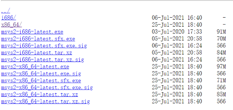

# 环境准备

## 一、MSVC

1. 操作系统 Windows 10

2. 编译器[Visual Studio Community 2019](https://visualstudio.microsoft.com/vs/community/)

   版本:16.8 以上( [部分支持C11,C17标准](https://docs.microsoft.com/cpp/overview/install-c17-support) )

   不支持变长数组(variable-length array，VLA),以及[其他不支持](https://devblogs.microsoft.com/cppblog/c11-and-c17-standard-support-arriving-in-msvc/)

3. Windows SDK

   [Windows SDK 10.0.20348.0 (版本 2104)](https://developer.microsoft.com/windows/downloads/windows-10-sdk/)或更高版本

4. 命令行cl.exe编译环境脚本

   [vcdev_x86.bat (32位)](vcdev_x86.bat) 

5. - [ ] **TODO** vscode配置 


6.  [C语言帮助文档](https://docs.microsoft.com/cpp/c-language/)

 

## 二、MinGW-W64

### 1. Cygwin、MinGW、MinGW-W64、MSYS、MSYS2

**a)** [Cygwin](https://cygwin.com/)是一个工具集环境，作用是：可以在windows中使用unix中的shell、工具或命令。可以看作windows下的**类unix子环境**，与wsl1有点类似。

基本原理是：基于一个中间库cygwin1.dll在windows上提供 unix系统所需的POSIX API接口，于是原来基于unix的常用工具的源码，可以编译成windows可执行文件；

unix命令行工具一般是基于shell运行的，所以连shell也要一起编译(也有部分需要额外移植的工作)，将常用的shell、unix命令工具编译后集成到一起就成了windows中的一个类似unix的子环境。

基于cygwin编译的程序必须依赖cygwin1.dll库，而且程序经过一层翻译，性能上也有些损耗，于是出现了MinGW

**b)** [MinGW](https://sourceforge.net/projects/mingw/)是对**GNU gcc编译工具及其相关工具链**在windows上的移植(从cygwin发展而来)，不再依赖中间库，直接调用windows api (并不提供某些难以用 Windows API 实现的 POSIX API，如 fork()，mmap() 和 ioctl())。重视简化与性能。

支持交叉编译(如：在linux系统下利用MinGW-GCC可以编译在windows系统运行的可执行文件)

由于gcc是unix程序，所以使用unix-shell环境编译会比较方便，最初用的就是cygmin,但是cygwin太多，扩展性、灵活性又差，所以出现了msys

**c)** MSYS也是基于cygmin的类unix环境，是它的简化版本。提供了MinGW需要的终端、shell等等基本环境。更小巧灵活

由于MinGW和MSYS更新太慢，不支持64位系统等原因，于是出现了相应的替代者

**d)** [MinGW-W64](http://mingw-w64.org/) 是MinGW的替代者，在MinGW只支持32位编译的基础上，又支持了64位。同时更新更快，对gcc较新版本支持更好。支持32位/64位系统应用的交叉编译(如在32位系统上编译64位的应用)

**e)** [MSYS2](https://www.msys2.org/)是MSYS的替代方案，同时支持了Cygwin(新版)，又提供一个包管理器pacman(来自Arch Linux)来管理需要的软件。支持MinGW的32位和64位，同时支持clang(原mac平台的编译器)

**小结**: MinGW-W64是gcc编译工具链在windows系统的移植版本；MSYS2是windows下的类unix命令行环境


### 2. 安装MSYS2与MinGW-W64

可以在[MSYS2](https://www.msys2.org/)首页直接下载`msys2-x86_64-20xxxxxx.exe`安装,也可以直接用[压缩包安装MSYS2](https://www.msys2.org/wiki/MSYS2-installation/)

[msys2分发库](http://repo.msys2.org/distrib/)下有可以选的安装文件:



64位系统选`msys2-x86_64-latest.tar.xz`,解压后有一个msys64文件夹,可以将其放到d盘根目录


#### 2.1.启动msys2

第一次启动时可以运行msys64下的`msys2_shell.cmd`脚本，会有一个初始化的过程；脚本默认以 **MSYS**的Shell环境 和 mintty终端启动 msys2:

```shell
# msys2_shell.cmd脚本最终默认执行以下命令：
start "MSYS2 MSYS" "%WD%mintty" -i "/msys2.ico" -t "MSYS2 MSYS" "/usr/bin/bash" --login !SHELL_ARGS!
# 命令解释：
# start是windows内置的启动新窗口的命令;"MSYS2 MSYS" 是start参数，启动窗口标题;后面跟的启动命令
# "%WD%mintty" ==> %WD%是msys可执行文件目录，mintty其下的可执行程序，用于开启一个终端窗口
# -i "/msys2.ico" -t "MSYS2 MSYS" 是mintty的参数，分别指定终端窗口左上角的：icon图标 和标题
# "/usr/bin/bash" --login !SHELL_ARGS! 是在mintty终端执行的bash程序，
# --login是bash启动参数,表示bash要以登录方式启动，它将执行/etc/profile里的命令，然后查找~/.bash_profile、 ~/.bash_login、~/.profile中存在并可读的第一个文件，执行里面的命令。退出时会执行~/.bash logout
# !SHELL_ARGS!变量是cmd脚本透传给bash的参数
```


shell(usr\bin\bash.exe)依赖三个环境变量：

1. CHERE_INVOKING 有值时，进入后bash会切换到当前目录
2. MSYS2_PATH_TYPE 控制进入后bash后：环境变量PATH的值，可选3个值:
	**strict**  只留msys2相关bin目录到PATH环境变量
	**minimal**  在strict基础上，保留了windows系统程序的路径，如/c/Windows/System32:/c/Windows等
	**inherit**  在strict基础上，继承了windows系统的PATH环境变量
3. MSYSTEM 切换进入bash后的子系统环境，可选值：MSYS|CLANG64|UCRT64|MINGW64|MINGW32
	默认MSYS


msys2中5个子系统环境(对应pacman包管理器中的5个库):

| 环境名/包库名 | 系统前缀 | 系统架构 | 系统HOST           | 工具链 | 包名前缀               | C库/C++库        |
| ------------- | -------- | -------- | ------------------ | ------ | ---------------------- | ---------------- |
| MSYS          | /usr     | x86_64   | x86_64-pc-msys     | gcc    | 无                     | cygwin/libstdc++ |
| MINGW64       | /mingw64 | x86_64   | x86_64-w64-mingw32 | gcc    | mingw-w64-x86_64       | msvcrt/libstdc++ |
| UCRT64        | /ucrt64  | x86_64   | x86_64-w64-mingw32 | gcc    | mingw-w64-ucrt-x86_64  | ucrt/libstdc++   |
| CLANG64       | /clang64 | x86_64   | x86_64-w64-mingw32 | llvm   | mingw-w64-clang-x86_64 | ucrt/libc++      |
| MINGW32       | /mingw32 | i686     | i686-w64-mingw32   | gcc    | mingw-w64-i686         | msvcrt/libstdc++ |

各子环境不同的环境变量：

PATH(应用路径)、ACLOCAL_PATH、MANPATH、PKG_CONFIG_PATH、XDG_DATA_DIRS

MSYSTEM(子环境名)、MSYSTEM_CARCH(系统架构)、MSYSTEM_CHOST(系统平台HOST)、MSYSTEM_PREFIX(子系统文件前缀目录)

MINGW_CHOST(MINGW平台名)、MINGW_PACKAGE_PREFIX(MINGW安装包前缀)、MINGW_PREFIX(MINGW文件前缀目录)、MINGW_MOUNT_POINT(mingw挂载点)


根据不同环境要求，后续可以用clang64.exe/mingw32.exe/mingw64.exe/msys2.exe/ucrt64.exe启动该msys环境


#### 2.2 包管理工具pacman

第一次安装后，运行`pacman -Syu` 更新系统包；运行`pacman -Su` 更新基础包

`pacman -Sy`只同步各包库的数据文件，不下载、更新或安装具体的应用


安装新包：`pacman -S <package_names|package_groups>`

移除包：`pacman -R <package_names|package_groups>`

搜索包：`pacman -Ss <name_pattern>`

搜索已安装的包：`pacman -Qs <name_pattern>`

查看包信息(包含依赖)：`pacman -Si <name_pattern>`

查看已安装包信息(包含依赖)：`pacman -Qi <name_pattern>`


#### 2.3 安装gcc

a) 直接搜索`pacman -Ss gcc`


​	我这选择/ucrt64环境，相应包前缀为  mingw-w64-ucrt-x86_64，所以相应gcc是mingw-w64-ucrt-x86_64-gcc

b) 更详细信息通过`pacman -Si mingw-w64-ucrt-x86_64-gcc`命令查看

c) 安装命令:`pacman -S mingw-w64-ucrt-x86_64-gcc`,需要确认时选Y

​	gcc.exe被安装到/ucrt64/bin目录下, 所以可以从ucrt64.exe启动环境

d) 编译命令:`gcc hw.c`

```c
/* hw.c 源码*/
#include <stdio.h>
int main(void){
    printf("Hello World!");
}
```

若安装成功，则会生成a.exe文件，执行a.exe输出`Hello World!`


## 三、gcc编译

### 1.编译过程：预处理、编译、汇编、链接

**1.1.预处理**：`选项-E`代表只作预处理( Preprocess only)，接收c源文件作为参数

```bash
#这条命令会把预处理结果输出到标准输出(终端显示器)
gcc -E hw.c

#选项-o会指定输出到文件，即把对hw.c的预处理结果输出到hw.i文件
gcc -E hw.c -o hw.i
```

处理做了什么：①处理预编译指令(宏展开，处理条件编译指令，处理文件包含)；删除所有注释；②添加行号和文件名标识；③保留#progma指令供编译器使用

**1.2.编译**：`选项-S`代表只作编译( Compile only)，接收预处理后的文件或c源文件作为参数

```bash
#编译预处理后的文件，省略选项-o时也会输出hw.s文件
gcc -S hw.i -o hw.s

#也可直接接收c源文件作为参数
gcc -S hw.c -o hw.s
```

编译过程就是把预处理完的文件进行词法分析、语法分析、语义分析、以及优化后台生成相应**汇编代码文件**

**1.3汇编**：`选项-c`代表只作汇编编译( Compile and assemble)，接收编译后的汇编代码文件或c源文件作为参数

```bash
#将编译后的汇编代码文件经行汇编，省略选项-o时也会输出hw.o文件
gcc -c hw.s -o hw.o

#也可直接接收c源文件作为参数
gcc -c hw.c -o hw.o
```

将汇编源码转变成机器可执行的指令,每一条汇编语句几乎都对应一条机器指令。生成一个**目标文件(object file)**

**1.4链接**:

`ld -static xx1.o xx2.o xx3.o ... xxx.o`

模块拼装--链接

链接过程：地址空间分配、符号决议、重定位

编译时用符号替代函数调用，外部变量，链接时对函数、变量地址进行修正。这个过程叫重定位。每个修正的地方叫重定位入口。

### 2.目标文件里有什么？

