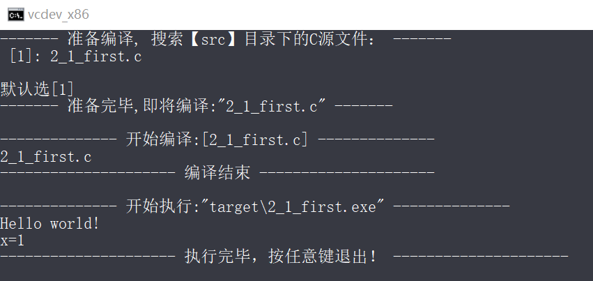
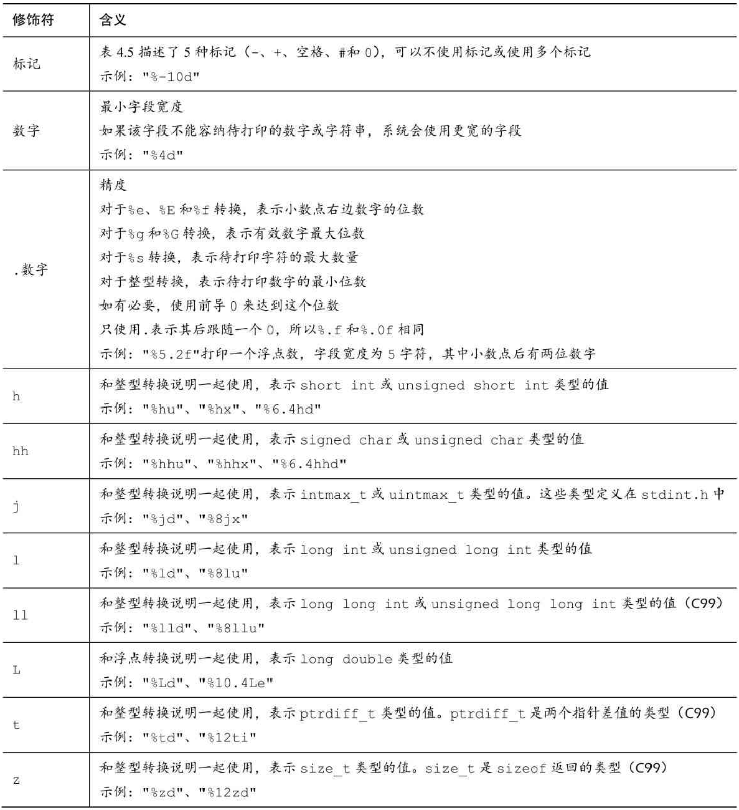
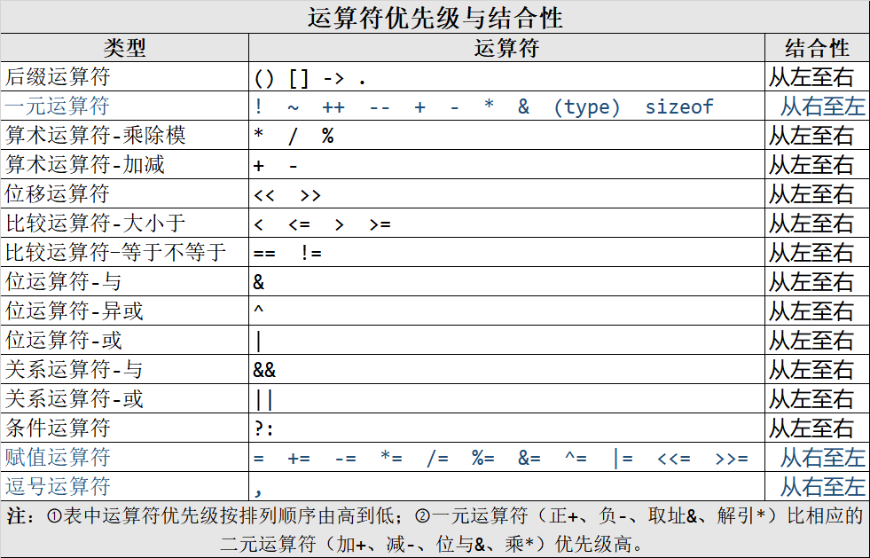
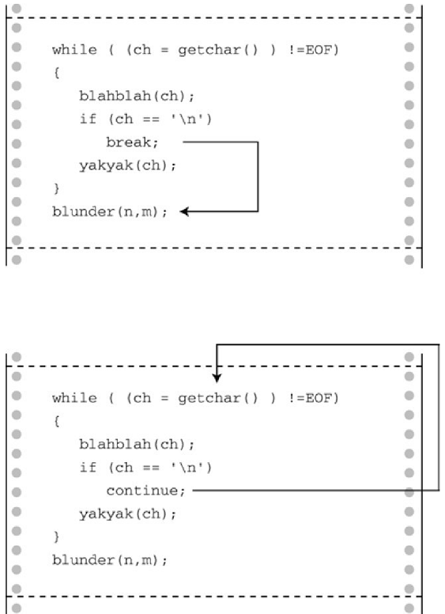
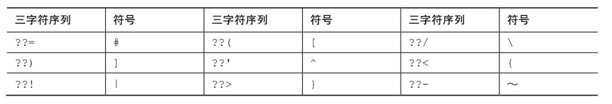
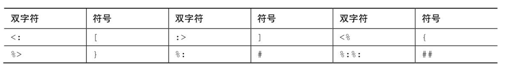

# 基本语法

*注：以下是<< c primer plus 6 >>学习笔记*

##  一、初识C

### 1. C语言标准

1978年 K&R C 传统C

1989年 ANSI C ==> C89 

1990年 ISO C ==> C90 与C89相同

  C精神:

1. 信任程序员
2. 不要妨碍程序员做需要做的事
3. 保持语言精练简单
4. 只提供一种方法执行一项操作
5. 让程序运行更快，即使不能保证其可移植性

1994年 ANSI/ISO ==> C99

新目标：国际化、弥补缺陷和提高计算的实用性

2011年 ISO  ==> C11

2018年  ISO  ==> C17

c语言标准委员会地址:[[Project status and milestones (open-std.org)](http://www.open-std.org/JTC1/SC22/WG14/www/projects#9899)]

标准文档(pdf)下载：
 [C99标准文档](http://www.open-std.org/JTC1/SC22/WG14/www/docs/n1256.pdf)   [C11标准文档](http://www.open-std.org/JTC1/SC22/WG14/www/docs/n1570.pdf)   [C17标准文档](http://www.open-std.org/JTC1/SC22/WG14/www/docs/n2310.pdf)   [C2x标准文档](http://www.open-std.org/JTC1/SC22/WG14/www/docs/n2596.pdf)


主要学习 C89/90  用C99或C11介绍新特性

[visual studio C标准库文档](https://docs.microsoft.com/cpp/c-runtime-library/reference/crt-alphabetical-function-reference)

[C语言帮助文档](https://docs.microsoft.com/cpp/c-language/)

### 2.编译过程

**Linux**:

c语言编译过程：

1. 预处理(Preprocessing)
       展开头文件/宏替换/去掉注释/条件编译 (.i)

2. 编译(Compilation)
       检查语法，生成汇编代码 (.s)

3. 汇编(Assembly)
       汇编代码转换机器码    (.o)

4. 链接(Linking)
       链接到一起生成可执行程序    (.out .a .so)

**Windows**:

源代码(.c) --> 编译器  --> 目标代码(.obj) --> 连接器+库代码+启动代码 --> 可执行代码(.exe,.dll)

 

## 二、Hello World

### 1. 代码

[2_1_first.c](src/2_1_first.c) :

```c
#include <stdio.h> //引入文件头

int main(void) /* 函数头: 返回类型 函数名(参数[这里是void]) */
{
    printf("Hello world!\n"); //调用stdio标准库里的printf函数, \n是换行符

    int x; /* 定义一个名为x的变量 */
    x = 1; /* 为x赋一个值 */ 
    printf("x=%d\n",x); //再次调用stdio标准库里的printf函数，并传参数
    return 0; //返回一个数
}
```

### 2. 编译&运行

自己写了个脚本([compileOneAndRun.bat](compileOneAndRun.bat))来编译执行这个程序：



### 3.注意

1. 每次用到库函数，都会用#include指令包含ANSI/ISO标准指定的头文件
2. main函数必须加(void),返回值必须是int


## 三、数据类型

关键字：int、short、long、unsigned、char、float、double、_Bool、_Complex、_Imaginary
运算符：sizeof()
函数：scanf()


C语言数据类型关键字：

| K&R C    | C90    | C99               |
| -------- | ------ | ----------------- |
| int      | signed | _Bool(true/false) |
| long     | void   | _Complex(复数)    |
| unsigned |        | _Imaginary(虚数)  |
| char     |        |                   |
| float    |        |                   |
| double   |        |                   |

### 1. 整数

   > 1. 声明变量   int a,b,c;
   >
   > 2. 初始化变量  int i=1,j=2;
   >
   > 3. printf int占位符%d  
   >
   >    如：printf("%d",i) 
   >
   >    示例：[3_1_platinum.c](src/3_1_platinum.c)
   >
   > 4. 字面量：
   >
   >    十进制  7,    8,  9,   10,  15,  16
   >
   >    八进制  07,  10, 11, 12,  17, 20 
   >
   >    十六进制  0x7, 0X8 , 0x9, 0XA, 0XF, 0x10
   >
   >    printf 显示八进制占位符： %o ,带0前缀 %#o
   >
   >     printf 显示十六进制占位符： %x ,  %X,  带0x前缀 %#x,%#X
   >    
   >    示例：[3_2_int_Literal.c](src/3_2_int_Literal.c)

### 2. 整数其他形式

   > 附属关键字 short long unsigned
   >
   > short int 或 short
   >
   > long int 或 long
   >
   > long long int或long long 至少64bit
   >
   > unsigned int 或 unsigned 无符号整数(非负)
   >
   > unsigned short ,  unsigned long , unsigned long long
   >
   > 任何有符号类型前添加关键字signed可以强调有符号(有负数)， 如 signed int 等同于 int
   >
   > 
   >
   > c语言规定 
   >
   > short占用空间不能比int多 ，long占用空间不能比int少
   >
   > 现在个人计算机常见设置：long long - 64bit, long 32bit, short 16bit, int 16bit或32bit(依计算机自然字长而定)
   >
   > 
   >
   > long和long long字面常量
   >
   > 数字字面量后加L或l,
   >
   > 在支持long long类型的系统中，也可以使用ll或LL后缀表示long long类型，u或U后缀表示无符号，如5ull,5Ull,5llU,5LLu
   >
   > 
   >
   > printf中unsigned 用%u前缀，short用%h前缀，long用%l前缀，long long用%ll前缀
   >
   > 示例[3_3_more_int.c](src/3_3_more_int.c)
   >
   > 
   >
   > 整数运算溢出时，从整数类型能表示最小值开始计算
   >
   > 
   >
   > char类型-1字节
   >
   > 字符'j'  '\x6A' '\0152'
   >
   > printf 占位符%c
   >
   > 有些C编译器把char实现为有符号类型，这意味着char可表示的范围是-128～127。而有些C编译器把char实现为无符号类型
   >
   > C90: 
   >
   > unsigned char表示无符号字节字符
   >
   > signed char表示有符号字节字符
   >
   > 
   >
   > `_Bool`类型
   > C99标准添加了`_Bool`类型，用于表示布尔值，即逻辑值true和false。因为C语言用值1表示true，值0表示false，所以`_Bool`类型实际上也是一种整数类型。但原则上它仅占用1位存储空间，因为对0和1而言，1位的存储空间足够了
   >
   > 
   >
   > C99可移植类型
   >
   > ​	stdint.h和inttypes.h
   >
   > int8_t~int64_t， uint8_t ~ uint64_t
   >
   > int_least8_t uint_least8_t
   >
   > int_fast8_t uint_fast8_t
   >
   > 
   >
   > intmax_t uintmax_t
   >
   > 

### 3. 浮点型

   >float、double和long double
   >
   >浮点字面量：
   >
   >有符号的数字(包括小数点)，后面紧跟e或E，最后是一个有符号数表示10的指数
   >
   >​	正号可以省略。可以没有小数点(如，2E5)或指数部分(如，19.28)，但是不能同时省略两者。
   >
   >可以省略小数部分(如，3.E16)或整数部分(如，.45E-6)，但是不能同时省略两者。
   >
   >
   >
   >C99 标准添加了一种新的浮点型常量格式——用十六进制表示浮点型常量，即在十六进制数前加上十六进制前缀(0x或0X)，用p和P分别代替e和E，用2的幂代替10的幂(即，p计数法)。如下所示：
   >0xa.1fp10
   >
   >
   >
   >printf()函数使用％f转换说明打印十进制记数法的float和double类型浮点数，用％e打印指数记数法的浮点数。如果系统支持十六进制格式的浮点数，可用a和A分别代替e和E。打印long double类型要使用％Lf、％Le或％La转换说明
   >
   >
   >
   >IEEE浮点标准,在C11作为可选项
   >
   >

### 4. 复数

   > 一般而言，虚数类型都是可选项。C11标准把整个复数软件包都作为可选项
   >
   > 
   >
   > C语言有3种复数类型：`float_Complex`、`double_Complex`和`long double _Complex`。例如，`float _Complex`类型的变量应包含两个float类型的值，分别表示复数的实部和虚部。
   >
   > 
   >
   > 类似地，C语言的3种虚数类型是float _Imaginary、`double _Imaginary`和`long double _Imaginary`。
   >
   > 
   >
   > 如果包含complex.h头文件，便可用complex代替`_Complex`，用imaginary代替`_Imaginary`，还可以用I代替-1的平方根。

### 5. 其他类型

   > C语言还有一些从基本类型衍生的其他类型，包括数组、指针、结构和联合

### 6. 类型大小

   > sizeof是C语言的内置运算符，以字节为单位给出指定类型的大小
   >
   > 
   >
   > C99和C11提供％zd转换说明匹配sizeof的返回类型(size_t)
   >
   > 示例：[3_4_sizeof.c](src/3_4_sizeof.c)

### 7. 转义字符

   > 警报声(\a) 退格(\b)、水平制表符(\t)和回车(\t)
   >
   > 示例[3_5_escape.c](src/3_5_escape.c)


## 四、字符串

### 1.  介绍字符串

> 字符数组，末尾加'\0' (null 字符)
>
> 注意：只能输入ANSI字符，why?因为需要支持'\0'字符结尾
>
> 示例:[4_1_string_intro.c](src/4_1_string_intro.c)
>
> C99 和 C11 标准专门为 sizeof 运算符的返回类型添加了％zd 转换说明
>
> scanf安全性不够，C4996提示用scanf_s


### 2. 预处理器 

   > #define NAME value
   >
   > 常量限定符 const(定义只读变量)
   >
   > limits.sh和float.h数据范围常量
   >
   > CHAR_MIN SHRT_MIN INT_MIN UINT_MIN ULONG_MIN FLT_MIN DBL_MIN
   >
   > CHAR_MAX SHRT_MAX INT_MAX UINT_MAX ULONG_MAX FLT_MAX DBL_MAX


### 3. printf & scanf

> 1. printf-转换说明符(conversion specification)
>
> 浮点数  -- 16进制和p计数法：%a、%A     10进制:%f   e计数法：%e,%E  自动匹配%g %G
> 单字符  --  %c
> 字符串  --  %s
> 有符号10进制整数  --   %d、%i
> 无符号10进制整数  --   %u
> 无符号8进制整数  --   %o
> 无符号16进制整数  --   %X、%x
> 指针  -- %p
>
> 2. printf-转换修饰符
>
>    
>
> 3. scanf
>
>    scanf()函数允许把普通字符放在格式字符串中
>
>    如：`scanf("％d,％d", &n, &m);` 必须输入逗号"," 但可以跳过空格
>
>    scanf()函数返回成功读取的项数。
>    没有读到或没有正确正确读取时scanf()返回0。
>    当scanf()检测到“文件结尾”时，会返回EOF
>
>    scanf("％c",num)会读取每个字符，包括空格
>
> 4. 如果你不想预先指定字段宽度，希望通过程序来指定，那么可以用`*`修饰符代替字段宽度。
>
>    但还是要用一个参数告诉函数，字段宽度应该是多少。
>
>    如`printf("The number is: ％*d.\n", width, number);`
>
>    scanf()中`*`的用法与此不同。把*放在％和转换字符之间时，会使得scanf()跳过相应的输出项


## 五、运算符

### 1.循环

> while (*condition*) { }
>
> 示例 [5_1_shoe_size.c](src/5_1_shoe_size.c)

### 2.运算符operator

> 赋值运算=
>
> 术语：数据对象、左值、右值和运算符
>
> 用于储存值的数据存储区域统称为**数据对象(data object)**
>
> **左值(lvalue)**是 C 语言的术语，用于标识特定数据对象的名称或表达式。因此，对象指的是实际的数据存储，而左值是用于标识或定位存储位置的标签。
>
> ​	可修改的左值(modifiable lvalue)，用于标识可修改的对象。
>
> ​    所以，赋值运算符的左侧应该是可修改的左值。当前标准建议，使用术语对象定位值(object locator value)更好
>
> 可以多重赋值：a=b=c=1;(赋值表达式 返回的结果就是被赋的值)
>
> 
>
> 算术运算符：加+、减-、乘*、除/
>
> 运算符优先级 ：
>
> 1. 小括号()最优先 ，从左往右结合
>
> 2. 正+负-号 (一元运算)
>
> 3. 乘除
>
> 4. 加+减-
>
> 5. 赋值=
>
> sizeof运算符 返回size_t类型
> 求模运算符 %
> 递增运算++
> 递减运算--
>
> 
>

### 3.表达式+语句

> 术语：
>
> **表达式(expression)**由运算符和运算对象组成
>
> 每个表达式都有一个值
>
> **语句(statement)**
>
> 语句(statement)是C程序的基本构建块。一条语句相当于一条完整的计算机指令。在C中，大部分语句都以分号结尾
>
> 例：赋值表达式语句的结构是，一个变量名，后面是一个赋值运算符，再跟着一个表达式，最后以分号结尾
>
> while语句是一种迭代语句，有时也被称为结构化语句，因为它的结构比简单的赋值表达式语句复杂
>
> 
>
> **副作用(side effect)**是对数据对象或文件的修改
>
> 完整表达式(full expression)，就是指这个表达式不是另一个更大表达式的子表达式
>
> **序列点(sequence point)**是程序执行的点，在该点上，所有的副作用都在进入下一步之前发生。在 C语言中，语句中的分号标记了一个序列点。意思是，在一个语句中，赋值运算符、递增运算符和递减运算符对运算对象做的改变必须在程序执行下一条语句之前完成。
>
> **复合语句(compound statement)**是用花括号括起来的一条或多条语句，复合语句也称为块(block)。
>
> 

### 4.类型转换

> 基本的类型转换规则:
>
> 1. 当类型转换出现在表达式时，从较小类型转换为较大类型，所以这些转换被称为升级(promotion)
> 2. 涉及两种类型的运算，两个值会被分别转换成两种类型的更高级别
> 3. 类型的级别从高至低依次是long double、double、float、unsigned long long、long long、unsigned long、long、unsigned int、int
> 4. 在赋值表达式语句中，计算的最终结果会被转换成被赋值变量的类型。这个过程可能导致类型升级或降级(demotion)。所谓降级，是指把一种类型转换成更低级别的类型。
> 5. 当作为函数参数传递时，char和short被转换成int，float被转换成double。
>
> 降级处理：
>
> 1. 目标类型是无符号整型，且待赋的值是整数时，额外的位将被忽略
>
> 2. 如果目标类型是一个有符号整型，且待赋的值是整数，结果因实现而异。
> 3.  如果目标类型是一个整型，且待赋的值是浮点数，该行为是未定义的。
>
> 
>
>  强制类型转换运算符:
>
> 圆括号和它括起来的类型名构成了强制类型转换运算符(cast operator)
>
> 如：int a=(int)1.5;

### 5.带参数的函数

> 声明参数就创建了被称为形式参数(简称形参)的变量
>
> 函数调用传递的值为实际参数，简称实参
>
> 是C99标准规定 :实参术语actual  argument;  形参术语formal parameter
>
> 示例[5_2_func_param.c](src/5_2_func_param.c)
>
> **函数声明**只指明了函数名和返回类型，没有指明参数类型
>
> **函数原型**在函数声明的基础上包含形参。

### 6.运算符优先级

> 
> 
>
> 


## 六、循环语句

### 1. while循环

> while( expression) 
>
> { statement }
>
> 入口条件循环entry condition

### 2. 条件运算符

   > < > == != >= <=
   >
   > 
   >
   > 一般而言，所有的非零值都视为真，只有0被视为假
   >
   > 
   >
   > C一直用int类型的变量表示真/假值。C99专门针对这种类型的变量新增了_Bool类型
   >
   > C99提供了stdbool.h头文件，该头文件让bool成为_Bool的别名，而且还把true和false分别定义为1和0的符号常量
   >

### 3. for循环

> while循环是不确定循环(indefinite loop)。所谓不确定循环，指在测试表达式为假之前，预先不知道要执行多少次循环。
>
> 还有一类是计数循环(counting loop)。这类循环在执行循环之前就知道要重复执行多少次。
>
> for循环语法：
>
> for　(　initialize;　test;　update　)
> 　　statement

### 4. 其他运算符

> 其他赋值运算符：+=、-=、*=、/=、％=
>
> **逗号运算符**扩展了for循环的灵活性，以便在循环头中包含更多的表达式

### 5. do while循环

> while循环和for循环都是入口条件循环，即在循环的每次迭代之前检查测试条件，所以有可能根本不执行循环体中的内容。
>
> C语言还有出口条件循环(exit-condition loop)，即在循环的每次迭代之后检查测试条件，这保证了至少执行循环体中的内容一次。
>
> 如 do while循环，语法：
>
> do{
> 　　statement;
> }while　(　expression　);

### 6.循环与数组

> 数组(array)是按顺序储存的一系列类型相同的值,。整个数组有一个数组名，通过整数下标访问数组中单独的项或元素(element)
>
> char类型的数组末尾包含一个表示字符串末尾的空字符\0，则该数组中的内容就构成了一个字符串
>
> ~~~c
> int nums[22]; // 可储存10个int类型的数组
> char str[]={'h','e','l','l','o','\0'}; //char数组，因为末尾有0,所以也是一个字符串
> ~~~
>
> 循环遍历数组：[6_1_for_loop_array.c](src/6_1_for_loop_array.c)


## 七、分支&跳转

### 1.判断if else

> if语句被称为分支语句(branching statement)或选择语句(selection statement)，因为它相当于一个交叉点，程序要在两条分支中选择一条执行。if语句的通用形式如下：
> `if ( expression ) { statement }`
>
> 
>
> if else语句的通用形式是：
>
> ```c
> if ( expression ) { statement }
> else { statement3} 
> ```
>
> 
>
> 
>
> 多重if else 
>
> ```c
> if ( expression1 ) { statement1} 
> else if ( expression2 ) { statement2} 
> else if ( expression3 ) { statement3} 
> else if ( expression4 ) { statement4} 
> ...
> else { statementN} 
> ```
>
> 
>
> 
>
> <stdio.h>中：
>
> getchar() 从输入队列中返回下一个字符
>
> putchar(char) 输出一个字符到显示器
>
> < ctype.h>中有字符判断函数:如isalpha(char), isblank(char), isdigit(char) isspace(char)  islower(char) issupper(char)等等
>
> 示例:[7_1_change_input.c](src/7_1_change_input.c)

### 2. 逻辑运算符

> 与&&  或|| 非 !
>
> 引入<iso646.h>(C95)可以用备选拼写
>
> && 对应 and ， || 对应 or  ， ! 对应 not

### 3. 条件运算符

> 又称三元运算符或三目运算符
>
> `expression1 ? expression2：expression3`
>
> 如果 expression1 为真(非 0)，那么整个条件表达式的值与 expression2 的值相同；如果expression1为假(0)，那么整个条件表达式的值与expression3的值相同
>
> 如求最大值：
>
> `max = (a > b) ? a：b;`

### 4. continue & break

> 3种循环都可以使用continue语句。执行到该语句时，会跳过本次迭代的剩余部分，并开始下一轮迭代。如果continue语句在嵌套循环内，则只会影响包含该语句的内层循环
>
> 程序执行到循环中的break语句时，会终止包含它的循环，并继续执行下一阶段。如果break语句位于嵌套循环内，它只会影响包含它的当前循环。
>
> 

### 5. switch+break

> 
> 语法:
> ```c
> switch ( 整型表达式)
> {
> 　　case 常量1：
> 　　　　语句　　　//可选
> 　　　　break;  //可选
> 　　case 常量2：
> 　　　　语句　　　//可选
> 　　　　break;  //可选
> 　　default：　　 //可选
> 　　　　语句　　　//可选
> 　　　　break;  //可选
> }
> ```
>

### 6. goto语句
> goto语句有两部分：goto和标签名。标签的命名遵循变量命名规则，如下所示：
> `goto part2;`
> 要让这条语句正常工作，函数还必须包含另一条标为part2的语句，该语句以标签名后紧跟一个冒号开始：
> `part2：printf("xxx");`
>
> **避免使用goto**

### 7. 字符操作、io流

> 缓冲区
>
> 大部分系统在用户按下Enter键之前不会重复打印刚输入的字符，这种输入形式属于缓冲输入。用户输入的字符被收集并储存在一个被称为缓冲区(buffer)的临时存储区，按下Enter键后，程序才可使用用户输入的字符
>
>  某些交互式程序也需要无缓冲输入。例如，在游戏中，你希望按下一个键就执行相应的指令
>
> 
>
> 可以用处理文件的方式来处理键盘输入。例如，程序读文件时要能检测文件的末尾才知道应在何处停止。因此，C 的输入函数内置了文件结尾检测器。既然可以把键盘输入视为文件，那么也应该能使用文件结尾检测器结束键盘输入
>
> 检测文件结尾的一种方法是，在文件末尾放一个特殊的字符标记文件结尾。CP/M、IBM-DOS和MS-DOS的文本文件曾经用过这种方法。
>
> 在C语言中，用getchar()读取文件检测到文件结尾时将返回一个特殊的值，即EOF(end of file的缩写，定义在stdio.h文件)。scanf()函数检测到文件结尾时也返回EOF
>
> 
>
> 字符操作：[7_1_char_get_put.c](src/7_1_char_get_put.c)
>
> 编译产生可执行文件：7_1_char_get_put.exe
>
> 1. 重定向输入，将my.txt文件的内容输出屏幕上:
>
>    `7_1_char_get_put.exe<my.txt`
>
> 2. 重定向输出，接收键盘输入，输出到my.txt文件
>
>    `7_1_char_get_put.exe>my.txt`
>
> 3. 组合重定向，复制my.txt到target.txt
>
>    `7_1_char_get_put.exe<my.txt>target.txt`
>
> 


## 八、函数

### 1.概念

> 函数是完成特定任务的独立程序代码单元
>
> 功能: 执行动作，返回值
>
> 
>
> **函数原型(function prototype)**告诉编译器函数名，函数的参数、返回类型。
>
> ​	函数的返回类型和形参列表构成了**函数签名(signature)**；
>
> **函数调用(function call)**表明在此处执行函数；
>
> **函数定义(function definition)**明确地指定了函数要做什么
>
> 
>
> 区分形参与实参
>
> 实际参数是出现在函数调用圆括号中的表达式。形式参数是函数定义的函数头中声明的变量。调用函数时，创建了声明为形式参数的变量并初始化为实际参数的求值结果
>
> 
>
> 声明函数时必须声明函数的类型。带返回值的函数类型应该与其返回值类型相同，而没有返回值的函数应声明为void类型。如果没有声明函数的类型，旧版本的C编译器会假定函数的类型是int。这一惯例源于C的早期，那时的函数绝大多数都是int类型。然而，C99标准不再支持int类型函数的这种假定设置。
> 类型声明是函数定义的一部分。要记住，函数类型指的是返回值的类型，不是函数参数的类型
>
> 示例:[8_1_func_type.c](scr/8_1_func_type.c)
>
> 
>
> 要正确地使用函数，程序在第 1 次使用函数之前必须知道函数的类型。方法之一是，把完整的函数定义放在第1次调用函数的前面。然而，这种方法增加了程序的阅读难度。而且，要使用的函数可能在C库或其他文件中。因此，通常的做法是提前声明函数，把函数的信息告知编译器。
>
> 
>
> 主调函数把它的参数储存在被称为栈(stack)的临时存储区，被调函数从栈中读取这些参数。
>
> 不定参函数：
>
> int printf(const char *, ...)
>
> 
>
> **递归**：允许函数调用它自己
>
> 优点是递归为某些编程问题提供了最简单的解决方案。
>
> 缺点是一些递归算法会快速消耗计算机的内存资源
>
> 示例：[8_2_fibonacci.c](src/8_2_fibonacci.c)
>
> 

### 2.  编译多源代码

> cl.exe可以使用@source-list.txt的形式引用多个文件
>
> /I设置include头文件，或放到c源文件同目录
>
> 示例:
> [8_3_add.h](include/8_3_add.h) 、[8_3_add_impl.c](src/8_3_add_impl.c)
> [my_pri_star.h](include/my_pri_star.h)  、[8_3_star_impl.c](src/8_3_star_impl.c)
> [8_3_include.h](src/8_3_include.h)、[8_3_compile_more.c](src/8_3_compile_more.c)
>   
>   多文件编译脚本:[compileMoreAndRun.bat](compileMoreAndRun.bat)
>   
>   

### 3. 指针初始

   > 指针(pointer)是 C 语言最重要的(有时也是最复杂的)概念之一，用于储存变量的地址
   >
   > 一元**&运算符**给出变量的存储地址。如果var是变量名，那么&var是变量的地址。可以把地址看作是变量在内存中的位置。
   >
   > 后跟一个变量名时，&给出该变量的地址。
   >
   > 
   >
   > 指针？什么是指针？从根本上看，指针(pointer)是一个值为内存地址的变量(或数据对象)
   >
   > 用间接**运算符***(indirection operator)
   >
   > 后跟一个指针名或地址时，*给出储存在指针指向地址上的值。
   >
   > 
   >
   > 声明指针变量时必须指定指针所指向变量的类型，因为不同的变量类型占用不同的存储空间
   >
   > ```c
   > int * pi; //pi是指向int类型变量的指针
   > char * pc; //pc是指向char型变量的指针
   > ```
   >
   > *和指针名之间的空格可有可无。通常，程序员在声明时使用空格，在解引用变量时省略空格。
   >
   > 
   >
   > pc指向的值(*pc)是char类型。pc本身是什么类型？我们描述它的类型是“指向char类型的指针”。
   >
   > pc 的值是一个地址，在大部分系统内部，该地址由一个无符号整数表示。但是，不要把指针认为是整数类型。一些处理整数的操作不能用来处理指针，反之亦然。
   >
   > 示例[8_4_pointer_intro.c](src/8_4_pointer_intro.c)
   >
   > 


## 九、数组和指针

### 1.数组

> 通过声明数组告诉编译器数组中内含多少元素和这些元素的类型
>
> 
>
> 只储存单个值的变量有时也称为标量变量(scalar variable)，我们已经很熟悉如何初始化这种变量：
> `int　fix　=　1;`
> `float flax = PI * 2;`
>
>  
>
> 以逗号分隔的值列表(用花括号括起来)来初始化数组，各值之间用逗号分隔
>
> `int arr[4] = {1，2，3，4};`
>
>  
>
> 注意 使用const声明数组
>
> 有时需要把数组设置为只读。这样，程序只能从数组中检索值，不能把新值写入数组。
>
> `const int arr[4] = {1，2，3，4};`
>
>  
>
> 数组自动存储类别，意思是这些数组在函数内部声明，且声明时未使用关键字static
>
> 当初始化列表中的值少于数组元素个数时，编译器会把剩余的元素都初始化为0。也就是说，如果不初始化数组，数组元素和未初始化的普通变量一样，其中储存的都是垃圾值；但是，如果部分初始化数组，剩余的元素就会被初始化为0
>
> 声明数组后，可以借助数组下标(或索引)给数组元素赋值
>
>
> C99 增加了一个新特性：指定初始化器(designated initializer)。利用该特性可以初始化指定的数组元素:
>
> ```c
> int arr[8]={0,0,0,0,0,0,123,0};//以前的赋值方法
> int arr[8]={[6]=212}//而C99规定，可以在初始化列表中使用带方括号的下标指明待初始化的元素
> arr[7=123;//根据索引赋值
> ```
>
> 示例：[9_1_designated.c](src/9_1_designated.c)
>
> 
>
> 在使用数组时，要防止数组下标超出边界,c语言不会检查边界
>
> 在C99标准之前，声明数组时只能在方括号中使用整型常量表达式。所谓整型常量表达式，是由整型常量构成的表达式。sizeof表达式被视为整型常量，但是(与C++不同)const值不是。另外，表达式的值必须大于0
>
> 
>
> 而C99标准允许这样声明，这创建了一种新型数组，称为变长数组(variable-length array)或简称 VLA(C11 放弃了这一创新的举措，把VLA设定为可选，而不是语言必备的特性)。
>
> 

### 2.多维数组

> 1. 说明：
>
>    一维数组：
>
>    ​	`type arr[SIZE1]={1,..};` //声明+初始化
>
>    ​	`type a=arr[index1]; `//从数组中取元素
>
>    ​    `arr[index1]=a;`/存储元素到数组
>
>    二维数组：
>
>    ​	`type arr[SIZE1][SIZE2]={{1,..},{2,..}};` //声明+初始化
>
>    ​	`type a=arr[index1][index2]; `//从数组中取元素
>
>    ​    `arr[index][index2]=a;`//存储元素到数组
>
>    N维数组： 
>
>    ​	`type arr[SIZE1][SIZE2]...[SIZE-N]={{...{1,..}...},...,{...{2,..}...}};` //声明+初始化
>
>    ​	`type a=arr[index1][index2]...[indexN]; `//从数组中取元素
>
>    ​    `arr[index1][index2]...[indexN]=a;`//存储元素到数组
>
>    N数组可以看作`SIZE1*SIZE2**...*SIZE-N`个元素的一维type类型数组或`type*`指针,所以可以按一维数组的初始化来初始化数据
>
> 2. 初始化：
>
> 初始化二维数组是建立在初始化一维数组的基础上
>
> 如一维数组是：`typex arr[2]={x1,x2}; `
>
> 假设typex是包含3个int的数组，那么相应二维数组表示为：
>
> `int arr[2][3]={{1,2,3},{4,5,6}}`
>
> 初始化时也可省略内部的花括号，只保留最外面的一对花括号。只要保证初始化的数值个数正确，初始化的效果与上面相同。但是如果初始化的数值不够，则按照先后顺序逐行初始化，直到用完所有的值
>
> 2. 同理可以声明多维数组
>
>    `int arr[1][2][3]`
>    
>    
>
> 

### 3.指针

> 指针提供一种以符号形式使用地址的方法
>
> 数组名是数组首元素的地址,
>
> ，如果arr是一个数组，下面的语句成立：
>
> ```c
> int arr[4];
> arr == &arr[0]; // 数组名是该数组首元素的地址
> ```
>
> 
>
> 指针的值是它所指向对象的地址。地址的表示方式依赖于计算机内部的硬件。许多计算机(包括PC和Macintosh)都是按字节编址，意思是内存中的每个字节都按顺序编号。这里，一个较大对象的地址(如double类型的变量)通常是该对象第一个字节的地址。
> 在指针前面使用*运算符可以得到该指针所指向对象的值。
>
> 例：[9_3_pointer_add.c](src/9_3_pointer_add.c)

### 4.函数+数组+指针

> 1.指针参数：[9_4_pointer_as_param.c](src/9_4_pointer_as_param.c)
>
> 2.指针运算优先级：
>
> ​	一元运算符*和++的优先级相同，但结合律是从右往左
>
> `*p++`  指针先递增 后取递增前的指针的值 等同于 `*(p++)`
>
> `*++p`  指针先递增 后取递增后的指针的值 等同于 `*(p++)`
>
> `(*p)++` 先取指针的值 后对值递增,表达式结果为递增前的值
>
> `++*p`  先取指针的值 后对值递增 ,表达式结果为递增后的值 等同于 `++(*p)`
>
> 
>
> &arr[3] 取数组arr第三个元素的地址
>
> 
>
> 数组变量与指针变量大多时候等价，但数组变量不能为左值,即一下代码会编译报错：
>
> ```c
> int arr[];
> arr++;//报错：error C2105: '++' needs l-value
> ```
>
> 

### 5.指针操作

> 1. 赋值 
>
>    把一个递增赋值给指针变量
>
>    `int i=0; int *p=&i;`
>
> 2. 解引用指针(*p)
>
>    `i==*p` 注意：不要解引用未初始化的指针
>
> 3. 获得指针的地址(&p)
>
>    `int **pp=&p;` 注意：不能对**符号常量**和**字面常量**取址
>
> 4. 指针加减法
>
>    `p++;p--;p+=2;p-=2;p=p+3;p=p-3;`
>
> 5. 两个指针求差
>
>    连个同类型指针的差为相差的类型的个数。
>
>    例:[9_5_ptr_diff.c](src/9_5_ptr_diff.c)

### 6.const

> 1. 对形式参数使用const
>
>    如果函数的意图不是修改数组中的数据内容，那么在函数原型和函数定义中声明形式参数时应使用关键字const
>
>    使用const并不是要求原数组是常量，而是该函数在处理数组时将其视为常量，不可更改
>
>    虽然用#define指令可以创建类似功能的符号常量，
>
>    但是const的用法更加灵活。可以创建**const数组**、**const指针**和**指向const的指针**。
>
> 2. 用法：
>
>    ```c
>    int i1=0;//i是变量，可以修改，可以赋值给常量
>    const int i2=i1; //i是整数常量(不能修改值),可以赋值给变量，不能赋值给非初始化的常量
>                                                                                                                                                                      
>    //存储整数变量的数组，数组中元素可以修改,但数组地址arr初始化后不能被修改，可给同类型数组初始化，可给同类型指针变量赋值或初始化，不能赋值给指针常量与数组
>    int arr1[]={1,2,3}; 
>    //存储整数常量的数组，数组中元素不能修改，arr初始化后不能被修改，可给同类型数组初始化，初始化或赋值给指针变量时告警，不能赋值给指针常量与数组
>    const int arr2[]={1,2,3}; 
>                                                                                                                                                                      
>    int * const cptr1={1,2,3}; //指向整数常量的指针常量 同整型变量数组
>    const int * const cptr2={1,2,3}; //指向整数常量的指针常量 同整型常量数组
>                                                                                                                                                                      
>    int *vptr1=arr1;//指向整数变量的指针变量，指针地址值可变
>    int *const vptr2=arr1;//指向整数变量的指针变量，指针地址值可变
>    ```
>
>    **注意：**const定义**不能修改的变量** 或**声明型常量**
>
>    所以：
>
>    1.数组变量 等同于  指针常量 ，如： ` int arr[]` <==> `int * const cptr`
>
>    2.可以在指针上用取元素操作，但不能在数组上用赋值或递增减操作，如 对： `cptr[0]`   错:`arr++`;
>
>    

### 7.多维数组+指针

> 指针,由于`[]运算符`优先级高于`*运算符`，所以：
>
> `type (*ptr) [N];`  //ptr是指向一个内含N个type类型值的数组的**指针**
>
> `type *pArr [N];`//pArr是一个包含N个`type *`类型元素的**数组**
>
>  例:[9_7_ptr_multi-d_array.c](src/9_7_ptr_multi-d_array.c)
>
> 不同类型的指针不能赋值
>
> 
>
> 多维数组形参声明：
>
> ```c
> //1.一个指向数组(内含4个int类型值)的指针。可以这样声明函数的形参:
> void somefunction1( int (* pt)[4] );
> //2.另外，如果当且仅当pt是一个函数的形式参数时，可以这样声明：
> void somefunction2( int pt[][4] );
> //3.也可以在第1对方括号中写上大小，如下所示，但是编译器会忽略该值：
> int somefunction3(int ar[3][4]， int rows); 
> //4.1.一般而言，声明一个指向N维数组的指针时，只能省略最左边方括号中的值：
> int somefunction4(int ar[][12][20][30], int rows);
> //4.2.因为第1对方括号只用于表明这是一个指针，而其他的方括号则用于描述指针所指向数据对象的类型。下面的声明与该声明等价：
> int somefunction4(int (*ar)[12][20][30],int rows); 
> ```
>
> 

### 8.变长数组

> 是C99/C11允许使用整型非常量表达式来初始化数组大小。这种情况下的数组被称为变长数组(variable-length array，VLA)，C99新增特性，需要编译参数开启
>
> 注意 变长数组不能改变大小
> 变长数组中的“变”不是指可以修改已创建数组的大小。一旦创建了变长数组，它的大小则保持不变。这里的“变”指的是：在创建数组时，可以使用变量指定数组的维度。
>
> ```c
>  //C99/C11 VLA函数原型：ar是一个变长数组(VLA)，省略了维度形参名
> int sum2d(int， int， int ar[*][*]);
> //该函数的定义如下：
> int　sum2d(int　rows，　int　cols，　int　ar[rows][cols]){
>     ...
>     return 0;
> }
> ```
>
> 
>
> visual studio 2019不支持
>
> 略过...

### 9.复合字面量

> C99新增了复合字面量(compound literal)。字面量是除符号常量外的常量。
>
> 对于数组，复合字面量类似数组初始化列表，前面是用括号括起来的类型名。例如，下面是一个普通的数组声明：
> int diva[2] = {10， 20};
> 下面的复合字面量创建了一个和diva数组相同的匿名数组，也有两个int类型的值：
> (int [2]){10， 20}　　　// 复合字面量
>
> 例：[9_8_compound_literal.c](src/9_8_compound_literal.c)
>


## 十、字符串

### 1.字符串定义 

> 字符串是以空字符(\0)结尾的char类型数组
>
> 定义方法：
>
> 1.字符串字面量(字符串常量)
>
> ​    用双引号括起来的内容称为字符串字面量(string literal)，也叫作字符串常量(string constant)
>
> ​    双引号中的字符和编译器自动加入末尾的\0字符，都作为字符串储存在内存中
>
> ​    用双引号括起来的内容被视为指向该字符串储存位置的指针
>
> ​    从ANSI C标准起，如果字符串字面量之间没有间隔，或者用空白字符分隔，C会将其视为串联起来的字符串字面量。
>
> ​    字符串常量属于静态存储类别(static storage class); 在函数中使用字符串常量，即使函数被调用多次,字符串也只会被储存一次
>
> 
>
> 2.字符串数组和初始化
>
> ```c
> char str1[]={'h','e','l','l','o','\0'};//注意最后的空字符。没有这个空字符，这就不是一个字符串，而是一个字符数组。
> const char str2[10]="hello";//数组长度要大于字符串长度
> const char str3[]="hello";//编译器自动计算数组长度
> str3 == &str3[0];//表达式为真
> *str3 == 'h';//表达式为真
> str3[1] == 'e';//表达式为真
> *(str3+1) == 'e';//表达式为真
> const char *str4="hello";//字符串字面量初始化指针
> ```
>
> 在C99新增变长数组之前，数组的大小必须是整型常量，包括由整型常量组成的表达式
>
> **注意：**初始化数组把静态存储区的字符串拷贝到数组中，而初始化指针只把字符串的地址拷贝给指针
>
> 示例:[10_1_string_define.c](src/10_1_string_define.c)
>
> puts()函数只显示字符串，而且自动在显示的字符串末尾加上换行符。也由<stdio.h>引入
>
> 
>
> 3.字符串数组
>
> 两种方法：
>
> 1.字符指针数组  或 指向指针的指针  
>
> ​	数组元素为指针，长度为  数组个数*指针占用长度，注意：指针数组最好不要修改，
>
> 2.字符数组的数组 
>
> ​	数组元素为字符数组，长度为 总数组个数* 字符数组长度
>
> 示例：[10_2_string_s_array.c](src/10_2_string_s_array.c)
>
> 

### 2. 字符串输入

> 如果想把一个字符串读入程序，首先必须预留储存该字符串的空间，然后用输入函数获取该字符串。
>
> 1. 分配空间
>
>    显式声明，指定数组大小
>
> 2. 输入函数，gets() 
>
> ​	  gets()函数：读取整行输入(直至遇到换行符), 然后储存换行符外的其余字符，并在添加一个'\0字符使其成为一个 C 字符串
>
> ​	示例[10_3_gets.c](src/10_3_gets.c)
>
> ​	  由于gets函数可能输入溢出，C11直接从标准中废除了gets()函数,增加可选扩展gets_s()函数
>
> ​	3.用fgets()函数：
>
> ​		函数的第2个参数指明了读入字符的最大数量。如果该参数的值是n，那么将读入n-1个字符，或者遇到第一个换行符为止。
>
> ​		如果`fgets()`读到一个换行符，会把它储存在字符串中。这点与gets()不同，gets()会丢弃换行符。
>
> ​		第3 个参数指明要读入的文件。如果从键盘输入的数据，以stdin（标准输入，定义在stdio.h中）作为参数
>
> ​    配合`fputs()`函数使用：
>
> ​	fputs()的第2个参数指明它要写入的文件。如果要显示在计算机显示器上，应使用stdout（标准输出）作为该参数。
>
> ​	示例[10_4_fgets_fputs.c](src/10_4_fgets_fputs.c)
>
> 4. gets_s()函数
>
>       示例[10_5_gets_s.c](src/10_5_gets_s.c);
>       
#### 2.附 自定义库函数

> 库文件存放目录lib
>
> 头文件目录include
>
> 示例:
>
> 函数定义-头文件:[my_io.h](src/my_io.h)
>
> 函数实现-源文件:[10_0_s_gets.c](src/10_0_s_gets.c)
>
> 库编译脚本:[compileMoreToLib.bat](compileMoreToLib.bat)
>
> 执行脚本，按步骤选择最终生成my_io.lib

### 3.字符串函数

> 1. `strlen()`用于统计字符串的长度
>
>    示例:[10_6_fit_by_strlen.c](src/10_6_fit_by_strlen.c)
>
> 2. `strcat()`用于拼接字符串, 接收2个参数，把第2个字符串附加到第1个末尾，返回第1个字符串地址
>
>    示例:[10_7_strcat.c](src/10_7_strcat.c)
>
> 3. `strncat()`前两个参和`strcat()`函数一样，该函数的第3个参数指定了最大添加字符数
>
>    示例：[10_8_strncat.c](src/10_8_strncat.c)
>
> 4. `strcmp()` 比较两个字符串参数，如果两个字符串相同， strcmp()返回0； 如果第1个字符串在第2个字符串后面，strcmp()返回正数。
>
>    示例：[10_9_strcmp.c](src/10_9_strcmp.c)
>
> 5. `strncmp()` 比较两字符串的最多前n个字符
>
>    示例:[10_10_strncmp.c](src/10_10_strncmp.c)
>
> 6. `strcpy()` 和`strncpy()` 参考赋值表达式语句， 很容易记住strcpy()参数的顺序， 即第1个是目标字符串， 第2个是源字符串  
>
>    2个属性： 
>
>    ① strcpy()的返回类型是 char *，该函数返回的是第 1个参数的值， 即一个字符的地址。
>
>     ②第 1 个参数不必指向数组的开始。   
>
>    strncpy(target, source, n)把source中的n个字符或空字符之前的字符（先满足哪个条件就拷贝到何处） 拷贝至target中。
>
>     因此， 如果source中的字符数小于n， 则拷贝整个字符串， 包括空字符。
>
>     但是， strncpy()拷贝字符串的长度不会超过n， 如果拷贝到第n个字符时还未拷贝完整个源字符串， 就不会拷贝空字符。   
>
>    示例：[10_11_strcpy_strncpy.c](src/10_11_strcpy_strncpy.c)
>
> 7. `sprintf()`  sprintf()的第1个参数是目标字符串的地址。 其余参数和printf()相同， 即格式字符串和待写入项的列表  
>
>    sprintf 位于stdio.h
>
>    示例:[10_12_sprintf.c](src/10_12_sprintf.c)
>
> 8. 其他函数 
>
>    1. `char *strchr(const char * s, int c);  `
>
>       如果s字符串中包含c字符， 该函数返回指向s字符串首位置的指针（末尾的空字符也是字符串的一部分， 所以在查找范围内） ；如果在字符串s中未找到c字符， 该函数则返回空指针
>
>    2. `char *strrchr(const char * s, int c);  `
>
>       该函数返回s字符串中c字符的最后一次出现的位置（末尾的空字符也是字符串的一部分， 所以在查找范围内）。 如果未找到c字符，则返回空指针
>
>    3. `char *strpbrk(const char * s1, const char * s2);  `
>
>       如果 s1 字符中包含 s2 字符串中的任意字符， 该函数返回指向 s1 字符串首位置的指针；如果在s1字符串中未找到任何s2字符串中的字符， 则返回空字符。
>
>    4. `char *strstr(const char * s1, const char * s2);  `
>
>       该函数返回指向s1字符串中s2字符串出现的首位置。 如果在s1中没有找到s2， 则返回空指针。
>
>    5. `size_t strlen(const char * s);  `
>
>       该函数返回s字符串中的字符数， 不包括末尾的空字符。  
>
> 9. 字符串排序
>
>    示例:[10_13_str_sort.c](src/10_13_str_sort.c)

### 4.ctype.h字符函数

> 处理字符,
>
> toupper()//转大写
>
> ispunct()是否是标准符号(punctuation)
>
> 示例:[10_14_modify_str.c](src/10_14_modify_str.c)

### 5.命令行参数

>  main()有两个参数时， 第1个参数是命令行中的字符串数量。  这个int类型的参数被称为argc，表示参数计数(argument count) 
> 系统用空格表示一个字符串的结束和下一个字符串的开始。 
> 入口程序把命令行字符串储存在内存中， 并把每个字符串的地址储存在指针数组中。
>  而该数组的地址则被储存在 main()的第 2 个参数中。 这个指向指针的指针称为argv，表示参数值[argument value] 。
>
> 示例[10_15_show_args.c](src/10_15_show_args.c)

### 6.字符串转数字

> 在stdlib.h头中
>
> 1. atoi()、 atol()和atof()函数把字符串形式的数字,分别转换成int、 long 和double类型的数字  
>
>     如果字符串仅以整数开头， atio()函数也能处理， 它只把开头的整数转换为字符  
>
>     在我们所用的C实现中， 如果命令行参数不是数字， atoi()函数返回0。 然而C标准规定， 这种情况下的行为是未定义的。  
>
>     示例:[10_16_more_hello.c](src/10_16_more_hello.c)
>
> 
>
> 2. strtol()、 strtoul()和strtod()函数把字符串形式的数字,分别转换成long、 unsigned long和double类型的数字。  
>
>    `long strtol(const char * nptr, char ** endptr, int base);`
>    
>    nptr是指向待转换字符串的指针， endptr是一个指针的地址， 该指针被设置为标识输入数字结束字符的地址，
>    base表示以几进制写入数字(最多36进制0-9a-z)。
>    
>    示例:[10_17_str_to_num.c](src/10_17_str_to_num.c)
>


## 十一、存储类别、内存

### 1.存储类别

被存储的数据内存，在c中称做对象(object)

标识符(identifier)可以用来指定（designate） 特定对象的内容  

可以用存储期（storage duration） 描述对象， 所谓存储期是指对象在内存中保留了多长时间。

 标识符用于访问对象， 可以用作用域（scope） 和链接（linkage） 描述标识符， 

标识符的作用域和链接表明了程序的哪些部分可以使用它。

 不同的存储类别具有不同的存储期、 作用域和链接。   

#### 1.1作用域

   > 1.块(block)是用花括号括起来的代码区域，
   >
   > ​	定义在块中的变量具有**块作用域(block scope)**，块作用域的可见范围是从定义处到包含该定义的块的末尾。
   >
   > 以前， 具有块作用域的变量都必须声明在块的开头。 C99 标准放宽了这一限制， 允许在块中的任意位置声明变量。 
   >
   > 为适应这个新特性， C99把块的概念扩展到包括for循环、 while循环、do while循环和if语句所控制的代码， 即使这些代码没有用花括号括起来，也算是块的一部分。 
   >
   > 2.**函数作用域(function scope)**,用于goto标签。即使一个标签首次出现在函数的内层块中， 它的作用域也延伸至整个函数。  
   >
   > 3.**函数原型作用域（function prototype scope）**用于函数原型中的形参名  ，作用域的范围是从形参定义处到原型声明结束  
   >
   > 只有在变长数组中， 形参名才有用  
   >
   > 4.变量的定义在函数的外面， 具有**文件作用域（ file scope）** ，从它的定义处到该定义所在文件的末尾均可见。  也称为全局变量（global variable）   
   >
   > 编译器源代码文件和所有的头文件都看成是一个包含信息的单独文件。 这个文件被称为翻译单元（translation unit）   
   >
   > 描述一个具有文件作用域的变量时， 它的实际可见范围是整个翻译单元。   
   >
   > 如果程序由多个源代码文件组成， 那么该程序也将由多个翻译单元组成。 
   >
   > 每个翻译单元均对应一个源代码文件和它所包含的文件。  

#### 1.2.链接

> C 变量有 3 种链接属性： **外部链接**、 **内部链接**或**无链接**。  
>
> 具有块作用域、 函数作用域或函数原型作用域的变量都是无链接变量。 这意味着这些变量属于定义它们的块、 函数或原型私有。   
>
> 具有文件作用域的变量可以是外部链接或内部链接。 
>
> 外部链接变量可以在多文件程序中使用， 内部链接变量只能在一个翻译单元中使用  
>
>  
>
> 一些程序员把“内部链接的文件作用域”简称为“文件作用域”， 
>
> 把“外部链接的文件作用域”简称为“全局作用域”或“程序作用域”。  
>
> 用static关键字声明内部链接，表明了其链接属性  

#### 1.3.存储期

> 作用域和链接描述了标识符的可见性。 存储期描述了通过这些标识符访问的对象的生存期。 
>
> C对象有4种存储期：
>
> **1.静态存储期**
>
> ​    具有静态存储期， 那么它在程序的执行期间一直存在。 文件作用域变量具有静态存储期。
>
> **2.线程存储期**
>
> ​    具有线程存储期的对象， 从被声明时到线程结束一直存在
>
> ​    以关键字_Thread_local声明一个对象时， 每个线程都获得该变量的私有备份。  
>
> **3.自动存储期**
>
> ​    块作用域的变量通常都具有自动存储期。 当程序进入定义这些变量的块时， 为这些变量分配内存； 当退出这个块时， 释放刚才为变量分配的内存.
>
> ​    变长数组稍有不同， 它们的存储期从声明处到块的末尾， 而不是从块的开始处到块的末尾
>
> **4.动态分配存储期**
>
> ​    动态分配的内存在调用 malloc()或相关函数时存在， 在调用 free()后释放。 这部分的内存由程序员管理。

#### 1.4.自动变量

> 属于自动存储类别的变量
>
> **作用域：块，链接：无，存储期：自动**
>
> 块作用域和无链接意味着只有在变量定义所在的块中才能通过变量名直接访问该变量  
>
> 变量具有自动存储期意味着， 程序在进入该变量声明所在的块时变量存在， 程序在退出该块时变量消失。   
>
> 
>
> 为了表明有意覆盖一个外部变量定义， 或者强调不要把该变量改为其他存储类别 ， 可以显式使用关键字`auto`
>
> ```c
> {
>  auto int index;	
> }
> ```
>
> `auto`关键字是存储类别说明符（storage-class specifier）  。
>
> 嵌套块中内层块中声明的变量与外层块中的变量同名时： 内层块会隐藏外层块的定义。  
>
> 示例：[11_1_block_var_hiding.c](src/11_1_block_var_hiding.c)
>
> 
>
> 1.没有花括号的块：
>
> 前面提到一个C99特性： 作为循环或if语句的一部分， 即使不使用花括号（{}） ， 也是一个块。 更完整地说， 整个循环是它所在块的子块（subblock） ， 循环体是整个循环块的子块。  
>
> 2.自动变量的初始化  
>
> 自动变量不会初始化， 除非显式初始化它。  

#### 1.5.寄存器变量

> 变量通常储存在计算机内存中 ,使用存储类别说明符`register`便可声明寄存器变量 ,使变量存在寄存器或高速内存中
>
> **作用域：块，链接：无，存储期：自动**
>
> ```c
> {
>     register int var;	
> }
> ```
>
> 声明变量为register类别与直接命令相比更像是一种请求。 
>
> 编译器必须根据寄存器或最快可用内存的数量衡量你的请求， 或者直接忽略你的请求， 所以可能不会如你所愿。
>
>  在这种情况下，寄存器变量就变成普通的自动变量。
>
> **不能**对该变量使用地址运算符 !!!
>
> 可声明为register的数据类型有限(看寄存器大小)

#### 1.6.块作用域的静态变量

> 静态变量（static variable）   ，静态的意思是该变量在内存中地址原地不动，变量是说内中的值可变
>
> **作用域：块，链接：无，存储期：静态**
>
> 使用`static`关键字在块中声明
>
>   示例:[11_2_block_static_var.c](src/11_2_block_static_var.c)

#### 1.7.外部链接的静态变量

> 称为外部存储类别（external storage class） ， 属于该类别的变量称为外部变量（external variable） 。 
>
> **作用域：文件，链接：外部，存储期：静态**
>
> 把变量的定义放在在所有函数的外面便创建了外部变量。  
>
> 为了指出该函数使用了外部变量， 可以在函数中用关键字extern再次声明
>
> 1. 初始化外部变量
>
>    外部变量只能初始化一次， 且必须在定义该变量时进行，如果未初始化外部变量， 它们会被自动初始化为 0  (也适用于外部定义的数组元素  )
>
>    只能使用常量表达式初始化文件作用域变量:
>
>    ```c
>    int x = 10; // 没问题， 10是常量
>    int y = 3 + 20; // 没问题， 用于初始化的是常量表达式
>    size_t z = sizeof(int); //没问题， 用于初始化的是常量表达式
>    int x2 = 2 * x; // 不行， x是变量
>    ```
>
> 2. 使用外部变量
>
>    在文件中定义的变量，在函数中可以不声明，直接使用
>
>    或显示的用extern关键字声明
>
> 3. 外部名称
>
>    C99和C11标准都要求:编译器识别局部标识符的前63个字符*(以前是31个)* 和外部标识符的前31个字符*(以前是6个)* 。
>
>    在程序编写环节，我们可以使用更长的字符。但是编译器会忽略超出的字符
>
> 4. 定义和声明
>
>    把变量的声明及定义放到某文件内，所有函数外的声明，称为：定义式声明（defining declaration）   
>
>    ​	定义式声明在所有源码文件中只能出现一次
>
>    在函数内或其他文件内使用在别处声明的变量，可用`extern`关键字显式声明，这种是：引用性声明(referencing declaration )
>
>    ​	引用性声明在所有源码文件中可以多次出现

#### 1.8.内部链接的静态变量

> static variable with internal linkage
>
> **作用域：文件，链接：内部，存储期：静态**
>
> 在所有函数外部（这点与外部变量相同）， 用存储类别说明符`static`定义的变量具有这种存储类别  
>
> 可以使用存储类别说明符 extern， 在函数中重复声明任何具有文件作用域的变量。 这样的声明并不会改变其链接属性  
>
> 
>
> 只有当程序由**多个翻译单元组**成时， 才体现区别内部链接和外部链接的重要性。  

#### 1.9.存储类别说明符

> storage-class specifier
>
> C语言有6个关键字作为存储类别说明符： auto、 register、 static、 extern、_Thread_local和typedef  
>
> (typedef关键字与任何内存存储无关， 把它归于此类有一些语法上的原因  )
>
> 示例(两文件需同时编译):[11_3_storage_cs1.c](src/11_3_storage_cs1.c)  [11_3_storage_cs2.c](src/11_3_storage_cs2.c)

#### 1.10.函数存储类别

> 函数也有存储类别， 可以是外部函数（默认） 或静态函数。 
>
> C99 新增了第3 种类别——内联函数
>
> 外部函数可以被其他文件的函数访问， 但是静态函数只能用于其定义所在的文件    
>
> 用 extern 关键字声明定义在其他位置(或其他文件)中的函数  。
>
> 除非使用static关键字，否则一般函数**声明**都默认为extern。  
>
> 
>
> 保护性程序设计的黄金法则是： “按需知道”原则。 尽量在函数内部解决该函数的任务， 只共享那些需要共享的变量。 


### 2.内存分配malloc()、free()

> 在程序运行时分配更多的内存：
>
> `malloc()`函数， 接受一个参数: 所需的内存字节数。
>
> 该函数会找到合适的空闲内存块， 这样的内存是匿名的  malloc()分配内存， 但是不会为其赋名。
>
> 返回动态分配内存块的首字节地址,ANSI C定义为指向void的指针。  可以转换为指向任意类型的指针
>
> 如果 malloc()分配内存失败， 将返回空指针  
>
> 
>
> malloc()要与free()配套使用。 free()函数的参数是之前malloc()返回的地址， 该函数释放之前malloc()分配的内存  
>
> free()的参数是一个指针， 指向由 malloc()分配的一块内存  
>
> 不能用 free()释放通过其他方式（如， 声明一个数组） 分配的内存。  
>
> malloc()和free()的原型都在stdlib.h头文件中  
>
> 
>
> 如果内存分配失败， 可以调用 exit()函数(stdlib.h中)结束程序。接收参数用于程序中止的返回
>
> 标准提供了两个返回值以保证在所有操作系统中都能正常工作：
>
> ​	 EXIT_SUCCESS（或者， 相当于0） 表示普通的程序结束， 
>
> ​	EXIT_FAILURE 表示程序异常中止。  
>
> 示例：[11_4_dynamic_array.c](src/11_4_dynamic_array.c)
>
> 
>
> 动态分配的内存数量只会增加， 除非用 free()进行释放  .
>
> 指针被销毁，但是内存没释放的问题被称为内存泄漏（memory leak）  
>
> free()所用的指针变量可以与 malloc()的指针变量不同， 但是两个指针必须储存相同的地址。   
>
> **不能**释放同一块内存两次  
>
> 
>
> 分配内存还可以使用calloc()  
>
> calloc()函数接受两个无符号整数作为参数（ANSI规定是size_t类型） 。 
>
> 第1个参数是所需的存储单元数量， 第2个参数是存储单元的大小（以字节为单位）  
>
> 如：
>
> ```c
> long * newmem;
> newmem = (long *)calloc(100, sizeof (long));
> ```
>
> calloc()函数还有一个特性： 它把块中的所有位都设置为0  
>
> free()函数也可用于释放calloc()分配的内存  
>
> 
>
> 可以认为程序把它可用的内存分为 3部分：
>
> 1. 一部分供具有外部链接、 内部链接和无链接的静态变量使用；在程序开始执行时被创建， 在程序结束时被销毁。
> 2. 一部分供自动变量使用；在程序进入变量定义所在块时存在， 在程序离开块时消失  
> 3. 一部分供动态内存分配 .在调用 malloc()或相关函数时存在， 在调用 free()后释放  
>
> 程序把静态对象、 自动对象和动态分配的对象储存在不同的区域  
>	
> 示例： [11_5_where_store.c](src/11_5_where_store.c) 


### 3.类型限定符

> 通常用类型和存储类别来描述一个变量。 C90 还新增了两个属性：**恒常性（constancy）** 和**易变性（volatility）** 
>
> 分别用关键字`const`和 `volatile`来声明， 以这两个关键字创建的类型是**限定类型（qualified type）**
>
>  C99标准新增了第3个限定符： `restrict`， 用于提高编译器优化。 
>
> C11标准新增了第4个限定符： `_Atomic`。   
>
> 
>
> C99 为类型限定符增加了一个新属性： 它们现在是幂等的（idempotent） 
>
> 意思是可以在一条声明中多次使用同一个限定符， 多余的限定符将被忽略  
>
> **1.const**
>
> 以const关键字声明的对象， 其值不能通过赋值或递增、 递减来修改。  
>
>   1.1.在指针和形参声明中使用const  
>
>   1.2.对全局数据使用const  
>
> **2.volatile**
>
>   volatile 限定符告知计算机， 代理（而不是变量所在的程序） 可以改变该变量的值。  
>
>   通常， 它被用于硬件地址以及在其他程序或同时运行的线程中共享数据。  
>
>  防止高速缓存或编译器优化变量
>
> **3.restrict**
>
> restrict 关键字允许编译器优化某部分代码以更好地支持计算  
>
> 只能用于指针， 表明该指针是访问数据对象的唯一且初始的方式。  
>
> restrict 关键字有两个读者。
>
> ​    一个是编译器， 该关键字告知编译器可以自由假定一些优化方案。 
>
>    另一个读者是用户， 该关键字告知用户要使用满足restrict要求的参数。   
>
> **4._Atomic**
>
> 当一个线程对一个原子类型的对象执行原子操作时， 其他线程不能访问该对象  
>
> 要通过各种宏函数来访问原子类型  
>
> 
>
> C99允许把类型限定符和存储类别说明符static放在函数原型和函数头的形式参数的初始方括号中  
>
> 对于类型限定符而言， 这样做为现有功能提供了一个替代的语法  
>
> ```c
> void ofmouth(int * const a1, int * restrict a2, int n); // 以前的风格
> void ofmouth(int a1[const], int a2[restrict], int n); // C99允许
> 
> /* static新用法,这里表明：函数调用中的实际参数应该是一个指向数组首元素的指针， 且该数组至少有20个元素 */
> double stick(double ar[static 20]);
> 
> ```
>
> 


## 十二、文件

### 1.文件通信

> C把文件看作是一系列连续的字节， 每个字节都能被单独读取。  
>
> C提供两种文件模式： 文本模式和二进制模式。  
>
> C和UNIX在文本中都使用\n（换行符） 表示换行  
>
> 在二进制模式中， 程序可以访问文件的每个字节。
>
>  而在文本模式中， 程序所见的内容和文件的实际内容不同。
>
> 程序以文本模式读取文件时，把本地环境表示的行末尾或文件结尾映射为C模式。     
>
> 
>
> 底层I/O（low-level I/O） 使用操作系统提供的基本I/O服务。  
>
> 标准高级I/O（standard high-level I/O） 使用C库的标准包和stdio.h头文件定义  
>
> C标准只支持标准I/O包。  C标准建立了可移植的I/O模型  
>
> 
>
> 标准文件：
>
> C程序会自动打开3个文件， 它们被称为标准输入（standard input） 、 标准输出（standard output） 和标准错误输出（standard error output） 。 
>
> 在默认情况下， 标准输入是系统的普通输入设备， 通常为键盘； 标准输出和标准错误输出是系统的普通输出设备， 通常为显示屏  

### 2.标准I/O

>  优点
>
>  ​	1.可移植
>
>  ​	2.提供专有函数，简化处理I/O问题
>
>  ​	3.输入和输出都是缓存的
>
>  
>
>  根据ANSI C的规定， 在最初调用的main()中使用return与调用exit()的效果相同  
>
>  
>
>  **2.1.fopen()函数  **
>
>  第1个参数：文件路径
>
>  第2个参数: 指定文件打开模式, 具体模式见下表：
>
>  | 模式字符串                                         | 含义                                                         |
>  | -------------------------------------------------- | ------------------------------------------------------------ |
>  | "r"                                                | 以读模式打开文件                                             |
>  | "w"                                                | 以写模式打开文件，若文件存在，截断文件长度为0，否则新建      |
>  | "a"                                                | 以写模式打开文件，若文件存在，在文件末尾追加内容，否则新建   |
>  | "r+"                                               | 以更新模式打开文件（即可读可写）                             |
>  | "w+"                                               | 以更新模式打开文件（即可读可写），若文件存在，截断文件长度为0，否则新建 |
>  | "a+"                                               | 以更新模式打开文件（即可读可写），若文件存在，在文件末尾追加内容，否则新建。可以读整个文件，单只能从末尾添加内容 |
>  | "rb","wb","ab","rb+","r+b","wb+","w+b","ab+","a+b" | 与以上模式类似，但以二进制模式打开文件(而非文本模式)         |
>  | "wx","wbx","w+x","wb+x","w+bx"                     | （C11标准)类似不加x的模式，但是如果文件存在或以独占模式打开文件，则打开文件 失败 |
>
>  　　像UNIX和Linux这样只有一种文件类型的系统， 带b字母的模式和不带b字母的模式相同  
>
>  　　C11带x字母的打开模式：１.不能打开已存在文件　２.ｘ模式有独占特性，
>
>  　　所有`"w"`模式打开现有文件都会先删除文件内容。
>
>  `fopen()`函数返回值文件指针（file pointer)　FILE*
>
>  文件指针并不指向实际的文件， 它指向一个包含文件信息的数据对象
>
>  其中包含操作文件的I/O函数所用的缓冲区信息。 因为标准库中的I/O函数使用缓冲区， 所以它们不仅要知道缓冲区的位置， 还要知道缓冲区被填充的程度以及操作哪一个文件。   
>
>  标准I/O函数根据这些信息在必要时决定再次填充或清空缓冲区。  
>
>  
>
>  **2.2.getc()和putc()函数**
>
>  getc()和putc()函数与getchar()和putchar()函数类似。 所不同的是， 要告诉getc()和putc()函数使用哪一个文件  
>
>  ```c
>  FILE* fp=fopen("myfile","rb+");
>  int ch = getc(fp);  //从fp指定的文件中获取一个字符  
>  putc(ch, fp);  //把字符ch放入FILE指针fp指定的文件中  
>  ```
>
>  getc()函数在读取一个字符时发现是文件结尾， 它将返回一个特殊值EOF 
>
>  
>
>  **2.3.fclose()函数**
>
>  fclose(fp)函数关闭fp指定的文件， 必要时刷新缓冲区。 对于较正式的程序， 应该检查是否成功关闭文件。
>
>  如果成功关闭， fclose()函数返回0， 否则返回EOF
>
>  如果磁盘已满、 移动硬盘被移除或出现I/O错误， 都会导致调用fclose()函数失败。   
>
>  
>
>  stdio.h头文件把3个文件指针(FILE*)与3个标准文件相关联， C程序会自动打开这3个标准文件。   
>
>  | 标准文件 | 文件指针 | 通常使用设备 |
>  | -------- | -------- | ------------ |
>  | 标准输入 | stdin    | 键盘         |
>  | 标准输出 | stdout   | 显示器       |
>  | 标准错误 | stderr   | 显示器       |
>
>  示例： [12_1_file_count.c](src/12_1_file_count.c) 
>
>  
>
>  **2.4.文件I/O函数**
>
>  **2.4.1.fprintf()、fscanf()**
>
>  与printf()、scanf()，只是第一个参数是文件指针：FILE*
>
>  示例： [12_2_fprintf.c](src/12_2_fprintf.c) 
>
>  
>
>  **2.4.2.fgets()、fputs()**
>
>  犍为介绍过fgets()函数。 
>
>  它的第1个参数和gets()函数一样， 也是表示储存输入位置的地址（char * 类型） ；
>
>  第2个参数是一个整数， 表示待输入字符串的大小(字符可用最大空间)； 
>
>  最后一个参数是文件指针， 指定待读取的文件。  
>
>  
>
>  fgets()函数读取输入直到第 1 个换行符的后面， 或读到文件结尾， 或者读取STLEN-1 个字符  
>
>  然后， fgets()在末尾添加一个空字符使之成为一个字符串。  
>
>  字符串的大小是其字符数加上一个空字符。如果fgets()在读到字符上限之前已读完一整行， 它会把表示行结尾的换行符
>  放在空字符前面  
>
>  fgets()函数在遇到EOF时将返回NULL值， 可以利用这一机制检查是否到达文件结尾； 如果未遇到EOF则之前返回传给它的地址。  
>
>  
>
>  fputs()函数把字符串写入到指定的FILE* 中，但不包括空字符。
>
>  接受两个参数： 第1个是字符串的地址； 第2个是文件指针。该函数根据传入地址找到的字符串写入指定的文件中。
>
>  和 puts()函数不同，fputs()在打印字符串时不会在其末尾添加换行符。   
>
>  示例：[10_4_fgets_fputs.c](src/10_4_fgets_fputs.c)


### 3.随机访问

> 
>
> 1.fseek()-设置文件访问位置，参数1：文件指针，参数2:偏移位置， 参数3：起始点
>
> ​	起始点：SEEK_SET--文件起始处  SEEK_CUR--当前位置 SEEK_END--文件末尾
>
> 2.ftell()函数的返回类型是long， 它返回的是当前的位置  (适用于以二进制模式打开的文件  )
>
> ​	ANSI C规定，对于文本模式，ftell()返回的值可以作为fseek()的第2个参数。
>
> 示例： [12_3_file_reverse.c](src/12_3_file_reverse.c) 
>
> 在文本模式中， 只有以下调用能保证其相应的行为:
>
> ```c
> fseek(filePtr,0L,SEEK_SET);//定位至文件开始处
> fseek(filePtr,0L,SEEK_CUR);//保持当前位置不动
> fseek(filePtr,0L,SEEK_END);//定位至文件结尾
> fseek(filePtr,ftell-pos,SEEK_SET);//距离文件开始处ftell-pos的位置，ftell是ftell()返回值
> ```
>
> 
>
> 
>
> 3.fsetpos()  和 fgetpos()处理较大文件的新定位函数,使用一种新类型： fpos_t（代表file position type， 文件定位类型）  
>
> `int fgetpos(FILE * restrict stream, fpos_t * restrict pos);  `
>
> ​	调用fgetpos时， 它把fpos_t类型的值放在pos指向的位置上， 该值描述了文件中的一个位置。 如果成功， fgetpos()函数返回0； 如果失败， 返回非0。
>
> `int fsetpos(FILE *stream, const fpos_t *pos);  `
>
> ​	调用该函数时， 使用pos指向位置上的fpos_t类型值来设置文件指针指向该值指定的位置。
>
>  如果成功， fsetpos()函数返回0； 如果失败， 则返回非0。fpos_t类型的值应通过之前调用fgetpos()获得。
>
> 
>
> 标准I/O的机制：
>
> 利用缓冲区(通常是512的倍数)，
>
> 调用stdio输入函数，文件数据块被拷贝到缓冲区，
>
> 输入函数按要求读取缓冲区数据，在它读取数据时，文件位置指示器被设置为指向刚读取字符的下一个字符  
>
> 当输入函数发现已读完缓冲区中的所有字符时， 会请求把下一个缓冲大小的数据块从文件拷贝到该缓冲区中。  
>
> 直到文件结尾。 函数在读取缓冲区中的最后一个字符后， 把结尾指示器设置为真。 于是， 下一次被调用的输入函数将返回EOF。  
>
> 输出函数以类似的方式把数据写入缓冲区。 当缓冲区被填满时， 数据将被拷贝至文件中。  

### 4.其他标准IO函数

> **1.ungetc()**
>
> `int ungetc(int,FILE*)`
>
> 函数把c指定的字符放回输入流中。 
>
> 如果把一个字符放回输入流， 下次调用标准输入函数时将读取该字符  
>
> **2.fflush()**
>
> `int fflush(FILE*) `
>
> 引起输出缓冲区中所有的未写入数据被发送到fp指定的输出文件。   
>
> 这个过程称为刷新缓冲区。   
>
> 如果 fp是空指针，所有输出缓冲区都被刷新 .
>
> 只要最近一次操作不是输入操作， 就可以用该函数来更新流（任何读写模式）  
>
> **3.setvbuf()  **
>
> `int setvbuf(FILE * restrict fp, char * restrict buf, int mode, size_t size);`
>
> 创建了一个供标准I/O函数替换使用的缓冲区。 在打开文件后且未对流进行其他操作之前， 调用该函数  
>
> 指针fp识别待处理的流， buf指向待使用的存储区。
>
>  如果buf的值不是NULL， 则函数会为自己分配一个  缓冲区。
>
>  变量size告诉setvbuf()数组的大小 。 
>
> mode的选择如下： 
>
> ​	_IOFBF表示完全缓冲（在缓冲区满时刷新） ；
>
> ​	 _IOLBF表示行缓冲（在缓冲区满时或写入一个换行符时） ；
>
>  	_IONBF表示无缓冲。
>
> 如果操作成功，函数返回0， 否则返回一个非零值。  
>
> **4.fwrite()**
>
> `size_t fwrite(const void * restrict ptr, size_t size, size_t nmemb,FILE * restrict fp);`
>
> 把二进制数据写入文件。   
>
> 指针ptr是待写入数据块的地址。 size表示待写入数据块的大小（以字节为单位） ，
>
>  nmemb表示待写入数据块的数量。 和其他函数一样，fp指定待写入的文件。     
>
> ```c
> char buffer[256];
> fwrite(buffer, 256, 1, fp);//把一块256字节的数据从buffer写入文件
> 
> double earnings[10];
> fwrite(earnings, sizeof(double), 10, fp);//把earnings数组中的数据写入文件， 数据被分成10块， 每块都是double的大小
> ```
>
> fwrite()函数返回成功写入项的数量。 正常情况下， 该返回值就是nmemb， 但如果出现写入错误， 返回值会比nmemb小。  
>
> **5.fread()**
>
> `size_t fread(void * restrict ptr, size_t size, size_t nmemb,FILE * restrict fp);  `
>
> fread()函数接受的参数和fwrite()函数相同。 在fread()函数中， ptr是待读取文件数据在内存中的地址， fp指定待读取的文件。 
>
> 该函数用于读取被fwrite()写入文件的数据。   
>
> ```c
> double earnings[10];
> fread(earnings, sizeof (double), 10, fp)//把10个double大小的值拷贝进earnings数组中
> ```
>
> fread()函数返回成功读取项的数量。 正常情况下， 该返回值就是nmemb， 但如果出现读取错误或读到文件结尾， 该返回值就会比nmemb小。  
>
> **6.feof()、ferror()**
>
> 如果标准输入函数返回 EOF， 则通常表明函数已到达文件结尾。 然而， 出现读取错误时， 函数也会返回EOF。 
>
> feof()和ferror()函数用于区分这两种情况。   
>
> 当上一次输入调用检测到文件结尾时， feof()函数返回一个非零值， 否则返回0。
>
>  当读或写出现错误， ferror()函数返回一个非零值， 否则返回0  
>
> 
>
> 示例A-把文件附加到另一个文件末尾： [12_4_attach_a_file.c](src/12_4_attach_a_file.c) 
>
> 
>
> 示例B-随机访问二进制文件: [12_5_rand_access_file.c](src/12_5_rand_access_file.c) 


## 十三、结构体、其他数据类型

### 1. 结构体

> **1.1.结构声明**
>
> 结构声明（structure declaration） 描述了一个结构的组织**布局**
>
> ```c
> struct [结构标记] {
>   结构成员1;//成员可以是任意一种C的数据类型， 甚至可以是其他结构
>   结构成员2;
>     ...
>   结构成员N;
> };
> ```
>
> 可以把这个声明放在所有函数的外部， 也可以放在一个函数定义的内部。 
>
> 如果把结构声明置于一个函数的内部， 它的标记就只限于该函数内部使用。
>
>  如果把结构声明置于函数的外部， 那么该声明之后的所有函数都能使用它的标记  
>
> 
>
> 结构的标记名是可选的。
>
>  但是在一处定义结构布局， 在另一处定义实际的结构变量时（以程序示例中的方式建立结构） ， 必须使用标记。 
>
> 示例： [13_1_struct_book.c](src/13_1_struct_book.c) 
>
> 结构布局告诉编译器如何表示数据， 但是它并未让编译器为数据分配空间  
>
> 下一步是创建一个结构变量  
>
> 
>
> **1.2.结构变量**
>
> `struct 结构标记名 结构变量名`
>
> 从本质上看结构声明创建了一个名为`struct 标记名`的新类型。
>
> `struct book library;  `是以下声明的简化：
>
> `struct book {
> char title[MAX_TITLE];
> char author[MAX_AUTH];
> float value;
> } library; /* 声明的右右花括号后跟变量名*/  `
>
> 声明结构的过程和定义结构变量的过程可以组合成一个步骤  
>
> 组合后的结构声明和结构变量定义不需要使用结构标记  ：
>
> `struct { /* 无结构标记 */
> char title[MAX_TITLE];
> char author[MAX_AUTH];
> float value;
> } library;  `
>
> 如果打算多次使用结构模板， 就要使用带标记的形式 ,或者`typeof`(待介绍)
>
> 
>
> **1.3.初始化结构**
>
> 类似数组的初始化：
>
> struct book library = {
> "The Pious Pirate and the Devious Damsel",
> "Renee Vivotte",
> 1.95
> };  
>
> 使用在一对花括号中括起来的初始化列表进行初始化，各初始化项用**逗号**分隔  
>
> 如果初始化一个静态存储期的结构， 初始化列表中的值必须是常量表达式。 
>
> 如果是自动存储期， 初始化列表中的值可以不是常量。  
>
> 
>
> **1.4.访问结构成员**
>
> 使用结构成员运算符**点(.)** 访问结构中的成员  
>
> library.value即访问library的value部分。 可以像使用任何float类型变量那样使用library.value。 
>
>  本质上: .title、 .author和.value的作用相当于book结构的下标。  
>
> 由于`.运算符`比`&运算符`优先级高，所以：&library.value与&(library.value)相同。
>
> 
>
> **1.5.指定初始化器**
>
> C99和C11为结构提供了指定初始化器（designated initializer） ,与数组的指定初始化器类似  
>
> 如只初始化book结构的value成员：`struct book surprise = { .value = 10.99};  `
>
> 也可以按照任意顺序使用指定初始化器：  
>
> `struct book gift = { .value = 25.99, .author = "James Broadfool", .title = "Rue for the Toad"};  `
>
> 
>
> 与数组类似， 在指定初始化器后面的普通初始化器， 为指定成员后面的成员提供初始值。   
>
> 如`struct book gift= {.value = 18.90, .author = "Philionna Pestle", 0.25};  `
>
> 0.25紧跟在.author成员后，所以覆盖了前面的18.90;
>
> 
>
> **1.6.结构数组**
>
> `struct book library[MAX_BOOKS];`
>
> 示例: [13_2_struct_array.c](src/13_2_struct_array.c) 
>
> 
>
> 
>
> **1.7.结构体嵌套**
>
> ```c
> struct name_t {
>     char first[STR_LEN];
>     char last[STR_LEN];
> };
> 
> struct guy{
>     struct name_t name;//嵌套另一个结构
>     char favfood[STR_LEN];
>     char job[STR_LEN];
>     float income;
> };
> ```
>
> 示例: [13_3_struct_nesting.c](src/13_3_struct_nesting.c) 

### 2.指向结构的指针

> 示例： [13_4_struct_pointer.c](src/13_4_struct_pointer.c) 
>
> 1.声明、初始结构指针
>
> `struct guy * him;  `
>
> `him = &fellow[0];  `
>
> 在有些系统中， 一个结构的大小可能大于它各成员大小之和。 这是因为系统对数据进行校准的过程中产生了一些“缝隙”。  
>
> 2.指针访问成员
>
> 如果him == &fellow[0]， 那么
>
> ​	`him->income == fellow[0].income`  //使用`->运算符`
>
> ​	`fellow[0].income == (*him).income`  //必须要使用圆括号， 因为.运算符比*运算符的优先级高  
>

### 3.向函数传递结构信息

> 现在的C允许把一个结构赋值给另一个结构， 但是数组不能这样做  
>
> 现在的C（包括ANSI C） ， 函数不仅能把结构本身作为参数传递， 还能把结构作为返回值返回。
>
> 
>
> C允许把一个结构赋值给另一个结构  
>
> 如果n_data和o_data都是相同类型的结构， 可以这样做：
>
> ```c
> o_data = n_data; // 把一个结构赋值给另一个结构
> ```
>
> 这条语句把n_data的每个成员的值都赋给o_data的相应成员。即使成员是数组， 也能完成赋值  
>
> 可以把一个结构初始化为相同类型的另一个结构  :
>
> ```c
> struct name_t right_field = {"Ruthie", "George"};
> struct name_t captain = right_field; // 把一个结构初始化为另一个结构
> ```
>
>  
>
> **1.结构体做参、返回vs结构指针做参**
>
> 结构体做为参数，其实是赋值给实参; 结构体返回会赋值给另一个变量
>
> 示例： [13_5_struct_in_func.c](src/13_5_struct_in_func.c) 
>
> 
>
> 编写一个与结构相关的函数， 是用结构指针作为参数， 还是用结构作为参数和返回值？  
>
> 指针：只需要传递一个地址，速度快，必要时用const保护数据
>
> 结构体：参数传递的优点是， 函数处理的是原始数据的副本， 这保护了原始数据。 另外， 代码风格也更清楚。   
>
> 
>
> **2.结构体中的字符数组和字符指针**
>
> 对于结构体中的
>
> ​	字符数组，数据保存在结构体内部，
>
> ​	字符指针，结构体中只存储地址，应该只用来在程序中管理那些已分配和在别处分配的字符串。  
>
> 指针危险：
>
> ```c
> struct name_t {
>  char *first;
>  char *last;
> } name;
> scanf("%s",&name.first); //潜在的危险，不知道数据会存到哪去
> ```
>
> 建议用malloc()分配地址，free()释放，
>
> 示例： [13_6_string_in_struct.c](src/13_6_string_in_struct.c) 
>
> 
>
> **3.复合字面量特性用于结构(C99)**
>
> 用于传参，赋值,
>
> `(struct book) {"The Idiot", "Fyodor Dostoyevsky", 6.99}`
>
> 复合字面量在所有函数的外部， 具有静态存储期； 如果复合字面量在块中， 则具有自动存储期。 
>
> 复合字面量和普通初始化列表的语法规则相同。 这意味着， 可以在复合字面量中使用指定初始化器  
>
> 
>
> **4.伸缩型数组成员（flexible array member）  **
>
> 1，该数组不会立即存在。 
>
> 2， 使用这个伸缩型数组成员可以编写合适的代码， 就好像它确实存在并具有所需数目的元素一样  
>
> 规则：伸缩型数组成员必须是结构的最后一个成员；结构中必须至少有一个成员；  
>
> 伸缩数组的声明类似于普通数组， 只是它的方括号中是空的。  
>
> ```c
> struct flex{ 
> int count;
> double average;
> double scores[]; // 伸缩型数组成员
> };
> 
> struct flex * pf; // 声明一个指针
> // 请求为一个结构和一个数组分配存储空间
> pf = malloc(sizeof(struct flex) + 5 * sizeof(double));
> ```
>
> 带伸缩型数组成员的结构确实有一些特殊的处理要求。 
>
> 第一， 不能用结构进行赋值或拷贝：  
>
> 第二， 不要以按值方式把这种结构传递给结构。  
>
> 第三， 不要使用带伸缩型数组成员的结构作为数组成员或另一个结构的成员  
>
> 
>
> **5.匿名结构(C11)**
>
> 在C11中， 可以用嵌套的匿名成员结构定义  :
>
> ```c
> struct person{
> int id;
> struct {char first[20]; char last[20];}; // 匿名结构
> };
> struct person ted = {8483, {"Ted", "Grass"}};//初始化ted的方式相同：
> puts(ted.first);//在访问ted时简化了步骤
> ```
>
> 
>
> **6.处理结构数组的函数**
>
> 假设一个函数要处理一个结构数组。 由于数组名就是该数组的地址， 所以可以把它传递给函数。
>
> 示例： [13_7_func_struct_arr.c](src/13_7_func_struct_arr.c) 
>
> 
>
> 7.结构保存到文件
>
> ```c
> struct book library[MAXBKS]; /* 结构数组 */
> ...
> fread(&library[count], size,1, pbooks);//读取一个book
> ...
> fwrite(&library[filecount], size, count - filecount,pbooks);//保存book数组
> ```
>
> 
>
> 其他结构...

### 4.联合(union)

> 联合（union） 是一种数据类型， 它能在同一个内存空间中储存不同的数据类型（不是同时储存）   
>
> 其典型的用法是， 设计一种表以储存既无规律、 事先也不知道顺序的混合类型  
>
> 使用联合类型的数组， 其中的联合都大小相等， 每个联合可以储存各种数据类型  
>
> 
>
> 创建联合和创建结构的方式相同， 需要一个联合模板和联合变量  
>
> ```c
> union hold {
> int digit;
> double bigfl;
> char letter;
> };//声明联合,只能储存一个int类型的值 或一个double类型的值 或char类型的值
> 
> union hold valA;
> valA.letter = 'R';
> union hold valB = valA; // 用另一个联合来初始化
> union hold valC = {88}; // 初始化联合的digit 成员
> union hold valD = {.bigfl = 118.2}; // 指定初始化器
> 
> union hold fit;
> fit.digit = 23; //把 23 储存在 fit， 占2字节
> fit.bigfl = 2.0; // 清除23， 储存 2.0， 占8字节
> fit.letter = 'h'; // 清除2.0， 储存h， 占1字节
> 
> pu = &fit;
> x = pu->digit; // 相当于 x = fit.digit
> ```
>
> 指针访问联合时也要使用->运算符  
>
> 
>
> 匿名联合和匿名结构的工作原理相同， 即匿名联合是一个结构或联合的无名联合成员  

### 5.枚举

> 可以用枚举类型（enumerated type） 声明符号名称来表示整型常量  
>
> 用enum关键字， 可以创建一个新“类型”并指定它可具有的值
>
> （实际上， enum常量是int类型， 因此， 只要能使用int类型的地方就可以使用枚举类型） 。 
>
> 枚举类型的目的是提高程序的可读性。 它的语法与结构的语法相同。  
>
> 声明：
>
> ```c
> enum spectrum {red, orange, yellow, green, blue, violet};
> enum spectrum color;
> ```
>
> 
>
> **5.1.enum常量**
>
> 从技术层面看是int常量
>
> `printf("red = %d, orange = %d\n", red, orange);`
> 其输出如下：
> red = 0, orange = 1  
>
> 在switch语句中， 可以把枚举常量作为标签。  
>
> 
>
> **5.2.默认值**
>
> 默认情况下， 枚举列表中的常量都被赋予0、 1、 2等。 因此， 下面的声明中nina的值是3：
> `enum kids {nippy, slats, skippy, nina, liz};  `
>
>  
>
> **5.3.赋值**
>
> 在枚举声明中， 可以为枚举常量指定整数值：
> enum levels {low = 100, medium = 500, high = 2000};  
>
> 如果只给一个枚举常量赋值， 没有对后面的枚举常量赋值， 那么后面的常量会被赋予后续的值。  
>
>  示例： [13_8_enum.c](src/13_8_enum.c) 
>
> 
>
> **共享命名空间**
>
> C语言使用名称空间（namespace） 标识程序中的各部分， 即通过名称来识别。 
>
> 作用域是名称空间概念的一部分： 两个不同作用域的同名变量不冲突； 两个相同作用域的同名变量冲突。
>
>  名称空间是分类别的。 在特定作用域中的结构标记、 联合标记和枚举标记都共享相同的名称空间， 该名称空间与普通变量使用的间不同。
>
>  这意味着在相同作用域中变量和标记的名称可以相同， 不会引起冲突， 但是不能在相同作用域中声明两个同名标签或同名变量。  

### 6.typeof

> typedef工具是一个高级数据特性， 利用typedef可以为某一类型自定义名称。 
>
> 这方面与#define类似， 但是两者有3处不同：
>
> 1.与#define不同， typedef创建的符号名只受限于类型， 不能用于值。
> 2.typedef由编译器解释， 不是预处理器。
> 3.在其受限范围内， typedef比#define更灵活。  
>
> ```c
> typedef unsigned char BYTE; //定义类型，
> BYTE x, y[10], * z; //声明变量
> ```
>
> 该定义的作用域取决于typedef定义所在的位置。 如果定义在函数中， 就具有局部作用域， 受限于定义所在的函数。 如果定义在函数外面， 就具有文件作用域

### 7.复杂声明

> 1.数组名后面的[]和函数名后面的()具有相同的优先级。 它们比`*（解引用运算符）` 的优先级高。
>
>  因此下面声明的risk是一个指针数组， 不是指向数组的指针  
>
> `int * risks[10];  `
>
> 2.[]和()的优先级相同， 由于都是从左往右结合， 所以下面的声明中，在应用方括号之前，` *`先与rusks结合。
>
>  因此rusks是一个指向数组的指针， 该数组内含10个int类型的元素：  
>
> `int (* rusks)[10];  `
>
> 3.[]和()都是从左往右结合。 因此下面声明的goods是一个由12个内含50个int类型值的数组组成的二维数组， 不是一个有50个内含12个int类型值的数组组成的二维数组  
>
> `int goods[12][50]; `

### 8.函数和指针

> 函数也有地址， 因为函数的机器语言实现由载入内存的代码组成。 指向函数的指针中储存着函数代码的起始处的地址  
>
> 声明一个函数指针时， 必须声明指针指向的函数类型。为了指明函数类型， 要指明函数签名， 即函数的返回类型和形参类型。    
>
> ```c
> void ToUpper(char *); // 把字符串中的字符转换成大写字符
> void (*pf)(char *); // pf 是一个指向函数的指针
> 
> void ToUpper(char *);
> void ToLower(char *);
> int round(double);
> void (*pf)(char *);
> pf = ToUpper; // 有效， ToUpper是该类型函数的地址
> pf = ToLower; //有效， ToUpper是该类型函数的地址
> pf = round; // 无效， round与指针类型不匹配
> pf = ToLower(); // 无效， ToLower()不是地址
> ```
>
> 由于运算符优先级的规则， 在声明函数指针时必须把*和指针名括起来  
>
> 调用语法:
>
> ```c
> void ToUpper(char *);
> void ToLower(char *);
> void (*pf)(char *);
> char mis[] = "Nina Metier";
> pf = ToUpper;
> (*pf)(mis); // 把ToUpper 作用于（语法1）
> pf = ToLower;
> pf(mis); // 把ToLower 作用于（语法2）
> ```
>
> K&R C不允许第2种形式  ,ANSI C兼容两种语法
>
> 
>
> 将函数指针作为函数的参数：
>
> ```c
> void show(void (* fp)(char *), char * str);//声明了两个形参： fp和str。 fp形参是一个函数指针， str是一个数据指针。
> 
> function1(sqrt); /* 传递sqrt()函数的地址 */
> function2(sqrt(4.0)); /* 传递sqrt()函数的返回值 */
> ```
>
> 示例： [13_9_function_pointer.c](src/13_9_function_pointer.c) 


## 十四、位操作

### 1.二进制、位、字节

>  以2为基底表示的数字被称为二进制数（binary number）   
>
>   
>
>  通常， 1字节包含8位。 C语言用字节（byte） 表示储存系统字符集所需的大小， 所以C字节可能是8位、 9位、 16位或其他值。 
>
>  不过， 描述存储器芯片和数据传输率中所用的字节指的是8位字节。
>
>   为了简化起见， 本章假设1字节是8位（计算机界通常用八位组(octet)这个术语特指8位字节） 。
>
>   可以从左往右给这8位分别编号为7～0。 
>
>  在1字节中， 编号是7的位被称为高阶位（high-order bit） ， 编号是0的位被称为低阶位（low-order bit） 。 
>
>  每 1位的编号对应2的相应指数。   
>
>  
>
>  如何表示有符号整数取决于硬件， 而不是C语言  
>
>  也许表示有符号数最简单的方式是用1位（如， 高阶位） 储存符号， 只剩下7位表示数字本身（假设储存在1字节中） 。 
>
>  用这种符号量（sign-magnitude） 表示法， 10000001表示-1， 00000001表示1。 因此， 其表示范围是-127～+127  
>
>   
>
>  二进制补码（two’s-complement）   
>
>  略
>
>  
>
>  浮点数：
>
>  符号部分 指数部分  数值部分
>
>  
>
>  八进制
>
>  3个二进制位转1个八进制位
>
>  
>
>  十六进制
>
>  4个二进制位转1个十六进制位

### 2.按位(bitwise)运算

> **2.1.按位取反**
>
> 运算符:`~`，把1变为0， 把0变为1  
>
> `～(10011010) // 表达式` ==> `(01100101) // 结果值  ` 
>
> 
>
> **2.2.按位与**
>
> 运算符`&`，通过逐位比较两个运算对象， 生成一个新值。
>
>  对于每个位， 只有两个运算对象中相应的位**都**为1时， 结果才为1
>
> （从真/假方面看，只有当两个位都为真时， 结果才为真） 
>
> `(10010011) & (00111101) // 表达式  ` ==> `(00010001) // 结果值  `
>
> 任何数和0按位与结果是0，任何数和1按位与结果是它本身
>
> 
>
> **2.3.按位或 **
>
> 运算符`|`，通过逐位比较两个运算对象， 生成一个新值。 
>
> 对于每个位， 如果两个运算对象中**至少有一个**的位为1， 结果就为1
>
> （从真/假方面看， 如果两个运算对象中相应的一个位为真或两个位都为真， 那么结果为真）   
>
>  `(10010011) | (00111101) // 表达式  ` ==> `(10111111) // 结果值  `
>
>  任何数和0按位或结果是它本身，任何数和1按位或结果是1
>
> 
>
> **2.4.按位异或**
>
> 运算符`^`,逐位比较两个运算对象。 
>
> 对于每个位， 如果两个运算对象中相应的位**不相同**(一个1一个0) ， 结果为1
>
> （从真/假方面看， 如果两个运算对象中相应的一个位不同(一真一假)， 那么结果为真） 。  
>
> `(10010011) ^ (00111101) // 表达式  ` ==> `(10101110) // 结果值  `
>
>  任何数和0按位异或或结果是它本身，任何数和1按位异或结果是它的取反数
>
> 
>
>  
>
> **2.5.用法**
>
> 1.掩码
>
> 如：只取某个数的第八位
>
> ```c
> int num=1234567890;
> int mask=0xff;//低八位掩码，高位全是0，低8位全是1，
> char low8=num&0xff;
> ```
>
> 
>
> 2.打开(设置)位
>
> 设掩码MASK只有1号位为1，打开flags的1号位：
>
> `flags = flags | MASK; `  或 `flags |= MASK; `
>
> 不管flags为何值，1号位和MASK(1)**按位或**后，是1，
>
> 其他位和MASK(0)**按位或**后不会变
>
> 
>
> 3.关闭(清空)位
>
> 设掩码MASK只有1号位为1，要关闭flags的1号位：
>
> `flags = flags & ～MASK;`   或  `flags &= ～MASK;  `
>
> 不管flags为何值，1号位和~MASK(0)**按位与**后，是0，
>
> 其他位和~MASK(1)**按位与**后不会变
>
> 
>
> 4.切换位
>
> 设掩码MASK只有1号位为1，要切换flags的1号位：
>
> `flags = flags ^ MASK;`  或 `flags ^= MASK;  `
>
> 不管flags为何值，1号位和~MASK(1)**按位异或**后，是它的取反数，
>
> 其他位和~MASK(0)**按位异或**后不会变
>
> 
>
> 5.检查位值
>
> 设掩码MASK只有1号位为1，检查flags的1号位是否为1：
>
> `(flags & MASK) == MASK` //相等是为1，不等时为0
>
> 
>
> **2.6位移运算符**
>
> `左移运算符<<` 将其左侧运算对象每一位的值向左移动其右侧运算对象指定的位数。 
>
> 左侧运算对象移出左末端位的值丢失， 用0填充空出的位置。   
>
> `(10001010) << 2 // 表达式  ` ==> `(10001010) << 2 // 表达式  `
>
> 
>
> `右移运算符>> `将其左侧运算对象每一位的值向右移动其右侧运算对象指定的位数。 
>
> 左侧运算对象移出右末端位的值丢。 对于无符号类型， 用0 填充空出的位置； 
>
> 对于有符号类型， 其结果取决于机器。   
>
> `(10001010) >> 2 // 表达式， 无符号值  ` ==> `(00100010) // 所有系统都得到该结果值  `
>
> 
>
> 3.用法
> 移位运算符针对2的幂提供快速有效的乘法和除法：
>
> ```c
> number << n //number乘以2的n次幂
> number >> n //如果number为非负， 则用number除以2的n次幂
> ```
>
> 
>
> 示例： [14_1_binbit.c](src/14_1_binbit.c) 
>

### 3.位字段

> 操控位的第2种方法是位字段（bit field） 。
>
> 位字段是一个signed int或unsigned int类型变量中的一组相邻的位（C99和C11新增了_Bool类型的位字段）   
>
> 位字段通过一个结构声明来建立， 该结构声明为每个字段提供**标签**，并确定该字段的**宽度**。   
>
> ```c
> struct {
> unsigned int autfd : 1; //冒号:后跟的是 位宽度
> unsigned int bldfc : 1;
> unsigned int undln : 1;
> unsigned int itals : 1;
> } prnt;
> 
> struct {
> unsigned int code1 : 2;//位宽度自定义，
> unsigned int code2 : 2;
> unsigned int code3 : 8;
> } prcode;
> 
> prcode.code3 = 102;//赋值时，要确保所赋的值不超出字段可容纳的范围
> ```
>
> 
>
> 可以用未命名的字段宽度“填充”未命名的“洞”  
>
> 可以用一个宽度为0的未命名字段迫使下一个字段与下一个整数对齐： 
>
> ```c
> struct {
> unsigned int field1 : 1 ;
> unsigned int : 2 ;
> 1160unsigned int field2 : 1 ;
> unsigned int : 0 ;
> unsigned int field3 : 1 ;
> } stuff;
> ```
>
> 在stuff.field1和stuff.field2之间， 有一个2位的空隙； stuff.field3将储存在下一个unsigned int中  
>
> 
>
> 示例： [14_2_bit_fields.c](src/14_2_bit_fields.c) 

### 4.对齐特征

> C11 的对齐特性比用位填充字节更自然， 它们还代表了C在处理硬件相关问题上的能力。   
>
> 在这种上下文中， 对齐指的是如何安排对象在内存中的位置。   
>
> 
>
> 有些情况又受益于对齐控制。 例如， 把数据从一个硬件位置转移到另一个位置， 或者调用指令同时操作多个数据项  
>
> 
>
> `_Alignof运算符`给出一个类型的**对齐要求**， 在关键字`_Alignof`后面的圆括号中写上类型名即可：
> `size_t d_align = _Alignof(float);  `
>
> 假设d_align的值是4， 意思是float类型对象的对齐要求是4。
>
> 也就是说，4是储存该类型值相邻地址的字节数。 一般而言， 对齐值都应该是2的非负整数次幂。
>
> 较大的对齐值被称为stricter或stronger， 较小的对齐值被称为weaker。  
>
> 
>
> 可以使用`_Alignas`说明符指定一个变量或类型的对齐值。   不应该要求该值小于基本对齐值  
>
> 该说明符用作声明的一部分， 说明符后面的圆括号内包含对齐值或类型  
>
> ```c
> Alignas(double) char c1;
> _Alignas(8) char c2;
> unsigned char _Alignas(long double) c_arr[sizeof(long double)];
> ```
>
> 示例： [14_3_align.c](src/14_3_align.c) 
>
> 
>
> C11在stdlib.h库还添加了一个新的内存分配函数， 用于对齐动态分配的内存。 该函数的原型如下：
> `void *aligned_alloc(size_t alignment, size_t size);  `
>
> vs2019不支持该函数
>
> realloc也不支持


## 十五、预处理、C库

### 0.预处理前做什么：

> 首先， 编译器把源代码中出现的字符映射到源字符集  
>
> 第二， 编译器定位每个反斜杠后面跟着换行符的实例， 并删除它们。  
>
> 第三， 编译器把文本划分成预处理记号序列、 空白序列和注释序列  ,编译器将用一个空格字符替换每一条注释  
>
> 最后， 程序已经准备好进入预处理阶段， 预处理器查找一行中以#号开始的预处理指令  

### 1. #define指令

> **1.1.定义明示常量**(manifest constant),也叫做符号常量
>
> 指令可以出现在源文件的任何地方， 其定义从指令出现的地方到该文件末尾有效  
>
> 
>
> \#define指令开头
>
> 接着是选定的缩写宏  ，当宏代表值时，称为类对象宏（object-like macro）  
>
> 指令行的其余部分  称为替换列表或替换体  
>
> 
>
> 从宏变成最终替换文本的过程称为宏展开（macroexpansion） 。  
>
> 
>
> 注意， 可以在#define行使用标准C注释。 每条注释都会被一个空格代替  
>
> 
>
> 宏可以表示任何字符串， 甚至可以表示整个 C 表达式  
>
> 预处理器只做宏展开（进行替换 ）不做计算，宏定义可以包含宏（宏嵌套）
>
> 示例: [15_1_preproc.c](src/15_1_preproc.c) 
>
> 
>
> 可以把宏的替换体看作是**记号(token)型**字符串，而不是字符型字符串  
>
> C预处理器记号是宏定义的替换体中单独的“词”。 用空白把这些词分开  
>
> 
>
> ANSI C标准， 只有新定义和旧定义完全相同才允许重定义  
>
> 具有相同的定义意味着替换体中的记号必须相同， 且顺序也相同  
>
> 
>
> **1.2.使用参数**
>
> 在#define中可以创建外形和作用与函数类似的类函数宏  
>
> 示例: [15_2_marco_args.c](src/15_2_marco_args.c) 
>
> 注意加括号
>
> 
>
> 在类函数宏的替换体中， #号作为一个预处理运算符， 可以把记号转换成字符串。  
>
> 如果x是一个宏形参， 那么#x就是转换为字符串"x"的形参名。   
>
> 示例： [15_3_marco_stringizing.c](src/15_3_marco_stringizing.c) 
>
> 
>
> 预处理粘合剂##
>
> ##运算符把两个记号组合成一个记号  
>
> 示例: [15_4_marco_glue.c](src/15_4_marco_glue.c) 
>
> 
>
> 变参宏
>
> 通过把宏参数列表中最后的参数写成省略号（即， 3个点...） 来实现可变参数。
>
> 定义宏`__VA_ARGS__`可用在替换部分中， 表明省略号代表什么。   
>
> 注意：省略号只能代替最后的宏参数  
>
> 示例： [15_5_marco_variadic_arg.c](src/15_5_marco_variadic_arg.c) 
>
> 
>
> 宏和函数的选择
>
> 宏和函数的选择实际上是时间和空间的权衡。 宏生成内联代码， 即在程序中生成语句
>
> C99提供了第3种可替换的方法——内联函数  
>
> 
>
> 对于简单的函数， 程序员通常使用宏， 如下所示：  
>
> ```c
> #define MAX(X,Y) ((X) > (Y) ? (X) : (Y))
> #define ABS(X) ((X) < 0 ? -(X) : (X))
> #define ISSIGN(X) ((X) == '+' || (X) == '-' ? 1 : 0)
> ```
>
>   

### 2.#include

> #include预编译指令，搜索.h文件顺序(msvs)：
> 1.绝对路径直接按绝对路径搜索
> 2.相对路径：
>  1.对于`双引号""`的（本地优先）：
>      1.先到当前c文件目录搜索
>      2.再到之前打开过的include文件的目录搜索
>      3.在编译器设置的路径搜索(/I选项)
>      4.在系统的INCLUDE环境变量内搜索
>  2.对于用`尖括号<>`的（设置路径优先）：
>      1.在编译器设置的路径搜索(/I选项)
>      2.在系统的INCLUDE环境变量内搜索
>
>  
>
> 头文件中最常用的形式如下 :
>
> **明示常量**——例如， stdio.h中定义的EOF、 NULL和BUFSIZE（标准I/O缓冲区大小） 。
> **宏函数**——例如， getc(stdin)通常用getchar()定义， 而getc()经常用于定义较复杂的宏， 头文件ctype.h通常包含ctype系列函数的宏定义。
> **函数声明**——例如， string.h头文件（一些旧的系统中是strings.h） 包含字符串函数系列的函数声明。 在ANSI C和后面的标准中， 函数声明都是函数原型形式。
> **结构模版定义**——标准I/O函数使用FILE结构， 该结构中包含了文件和与文件缓冲区相关的信息。 FILE结构在头文件stdio.h中。类型定义——标准 I/O 函数使用指向 FILE 的指针作为参数。 通常，stdio.h 用#define 或typedef把FILE定义为指向结构的指针。 类似地， size_t和time_t类型也定义在头文件中。  
>
> 
>
> 另外， 还可以使用头文件声明外部变量供其他文件共享  
>
> 需要包含头文件的另一种情况是， 使用具有文件作用域、 内部链接和const 限定符的变量或数组 

### 3.其他指令

> **3.1.#undef指令**
>
> #undef指令用于“取消”已定义的#define指令。  
>
> 如果想使用一个名称， 又不确定之前是否已经用过， 为安全起见， 可以用#undef 指令取消该名字的定义  
>
> \#define宏的作用域从它在文件中的声明处开始， 直到用#undef指令取消宏为止， 或延伸至文件尾（以二者中先满足的条件作为宏作用域的结束）   
>
> 预定义宏(如`__DATE__`和`__FILE__`)不能取消
>
> 
>
> **3.2.\#ifdef、 #else和#endif指令  **
>
> 如：
>
> ```c
> #ifdef MAVIS // 如果已经用#define定义了 MAVIS， 则执行下面的指令
> #include "horse.h"
> #define STABLES 5
> #else  //如果没有用#define定义 MAVIS， 则执行下面的指令
> #include "cow.h"
> #define STABLES 15
> #endif
> ```
>
> \#ifdef #else很像C的if else。 两者的主要区别是， 预处理器不识别用于标记块的花括号（{}） ， 因此它使用#else（如果需要） 和#endif（必须存在）来标记指令块。   
>
> 示例： [15_6_ifdef.c](src/15_6_ifdef.c) 
>
> 
>
> **3.3.\#ifndef指令**
>
> \#ifndef指令与#ifdef指令的用法类似， 也可以和#else、 #endif一起使用，但是它们的逻辑相反。 #ifndef指令判断后面的标识符是否是未定义的， 常用于定义之前未定义的常量。  
>
> ```c
> /* arrays.h */
> #ifndef SIZE
> #define SIZE 100
> #endif  
> 
> /* things.h */
> #ifndef THINGS_H_
> #define THINGS_H_
> /* 省略了头文件中的其他内容*/
> #endif
> ```
>
> \#ifndef指令通常用于防止多次包含一个文件。  
>
> 
>
> 通常， 实现的供应商使用这些方法解决这个问题： 用文件名作为标识符、 使用大写字母、 用下划线字符代替文件名中的点字符、 用下划线字符做前缀或后缀（可能使用两条下划线） 。   
>
> 
>
> 但是， 由于标准保留使用下划线作为前缀， 所以在自
> 己的代码中不要这样写， 避免与标准头文件中的宏发生冲突。   
>
> 示例：
>
> 
>
> **3.4.#if和#elif指令  **
>
> \#if后面跟**整型常量表达式**， 如果表达式为**非零， 则真**。 可以在指令中使用C的关系运算符和逻辑运算符：
>
> 按照if else的形式使用#elif  
>
> ```c
> #if SYS == 1
> #include "ibmpc.h"
> #elif SYS == 2
> #include "vax.h"
> #elif SYS == 3
> #include "mac.h"
> #else
> #include "general.h"
> #endif
> ```
>
> 较新的编译器提供另一种方法测试名称是否已定义， 即用`#if defined(VAX)`代替`#ifdef VAX`。
>
> ```c
> #if defined (IBMPC)
> #include "ibmpc.h"
> #elif defined (VAX)
> #include "vax.h"
> #elif defined (MAC)
> #include "mac.h"
> #else
> #include "general.h"
> #endif
> ```
>
> 
>
> **3.5.预定义宏**
>
> | 宏                 | 含义                                    |
> | ------------------ | --------------------------------------- |
> | `__FILE__`         | 当前源码文件名字符串字面量"Mmm dd yyyy" |
> | `__DATE__`         | 预处理的日期                            |
> | `__TIME__`         | 代码翻译的时间"hh:mm:ss"                |
> | `__LINE__`         | 源码文件行号，整型常量                  |
> | `__STDC__`         | 为1时遵循c标准                          |
> | `__STDC_HOSTED__`  | 本机环境1，否者0                        |
> | `__STDC_VERSION__` | 标准版本(C99为199901L,C11为201112L)     |
> | `__func__`         | 当前函数体的函数名                      |
>
> 示例：[15_8_predifined_mac.c](src/15_8_predifined_mac.c) 
>
> 
>
> **3.6.#line、#error**
>
> \#line指令重置`__LINE__`和` _FILE__`宏报告的行号和文件名  
>
> ```c
> #line 1000 // 把当前行号重置为1000
> #line 10 "cool.c" // 把行号重置为10， 把文件名重置为cool.c
> ```
>
> 
>
> \#error 指令让预处理器发出一条错误消息， 该消息包含指令中的文本。如果可能的话， 编译过程应该中断。   
>
> ```c
> #if __STDC_VERSION__ != 201112L
> #error Not C11
> #endif
> ```
>
>  
>
> **3.7.#pragma**
>
> 编译指示（pragma）  
>
> \#pragma把编译器指令放入源代码中  
>
> 如：\#pragma c9x on  
>
> C99还提供_Pragma预处理器运算符， 该运算符把字符串转换成普通的编译指示  
>
> _Pragma("nonstandardtreatmenttypeB on")
> 等价于下面的指令：
> \#pragma nonstandardtreatmenttypeB on  
>
> 
>
> C99 标准提供了 3 个标准编译指示:
>
> \#pragma STDC FP_CONTRACT on-off-switch
> \#pragma STDC FENV_ACCESS on-off-switch
> \#pragma STDC CX_LIMITED_RANGE on-off-switch  
>
>  
>
> **3.8.泛型选择**
>
> C11新增了一种表达式， 叫作泛型选择表达式（generic selection expression）  
>
> 可根据表达式的类型（即表达式的类型是int、 double 还是其他类型） 选择一个值  
>
> ```c
> /*
> 关键字：_Generic
> 圆括号中表达式用逗号,分隔
> 第一项是表达式
> 后面每项由 类型、冒号、值 组成
> 与switch类似：
> 如:x是整型就返回0，是float就返回1，是double就返回2，没匹配到就返回默认default的3
> */
> _Generic(x, int: 0, float: 1, double: 2, default: 3);
> ```
>
>  示例：[15_9_generic_type.c](src/15_9_generic_type.c) 
>
>  

### 4.内联函数

> 函数的调用过程包括建立调用、传递参数、 跳转到函数代码并返回  
>
>  使用宏使代码内联， 可以避免这样的开销  
>
> C99还提供另一种方法： 内联函数（inline function）  
>
> C99和C11标准中叙述的是： “把函数变成内联函数建议尽可能快地调用该函数， 其具体效果由实现定义”。
>
>  因此， 把函数变成内联函数， 编译器可能会用内联代码替换函数调用， 并（或） 执行一些其他的优化， 但是也可能不起作用  
>
> 
>
> 标准规定具有内部链接的函数可以成为内联函数， 还规定了内联函数的定义与调用该函数的代码必须在同一个文件中。   
>
> 因此， 最简单的方法是使用**函数说明符`inline` **和存储类别说明符`static`。  
>
> ```c
> inline static void eatline(){ //内联函数定义/原型
>   while (getchar() != '\n')
>   continue;
> }
> ```
>
> 由于并未给内联函数预留单独的代码块， 所以无法获得内联函数的地址  （ 实际上可以获得地址， 不过这样做之后， 编译器会生成一个非内联函数）
>
>   
>
> 如果程序有多个文件都要使用某个内联函数， 那么这些文件中都必须包含该内联函数的定义。 最简单的做法是， 把内联函数定义放入头文件， 并在使用该内联函数的文件中包含该头文件即可  
>
> 一般都不在头文件中放置可执行代码， 内联函数是个特例。 因为内联函数具有内部链接， 所以在多个文件中定义同一个内联函数不会产生什么问题  

### 5._Noreturn

> C11新增了第2个函数说明符`_Noreturn`， 表明调用完成后函数不返回主调函数  
>
> exit()函数是_Noreturn 函数的一个示例， 一旦调用exit()， 它不会再返回主调函数  
>
> (注意， 这与void返回类型不同。 void类型的函数在执行完毕后返回主调函数，只是它不提供返回值。  )
>
> 

### 6.C库

> 1.访问c库
>
> 3种方法：a) 自动访问  b) 文件包含  c) 库包含
>
> 
>
> 2.数学库math.h
>
> 示例1： [15_10_rect_pol_.c](src/15_10_rect_pol_.c) 
>
> 示例2： [15_11_generic.c](src/15_11_generic.c) 
>
> 
>
> tgmath.h 库 头文件中定义了泛型类型宏  ，与 [15_11_generic.c](src/15_11_generic.c) 类似
>
> 如果在math.h中为一个函数定义了3种类型（float、 double和longdouble） 的版本， 那么tgmath.h文件就创建一个泛型类型宏， 与原来 double版本的函数名同名。
>
> 例如， 根据提供的参数类型， 定义 sqrt()宏展开为sqrtf()、 sqrt()或 sqrtl()函数  
>
> 
>
> 如果包含了tgmath.h， 要调用sqrt()函数而不是sqrt()宏， 可以用圆括号把被调用的函数名括起来  
>
> ```c
> #include <tgmath.h>
> ...
> float x = 44.0;
> double y;
> y = sqrt(x); // 调用宏， 所以是 sqrtf(x)
> y = (sqrt)(x); // 调用函数 sqrt()
> ```
>
> 
>
> 3.通用工具库stdlib.h
>
> exit()函数 退出系统，main()返回系统时将自动调用exit()函数  
>
> atexit()函数通过退出时注册被调用的函数  
>
> 示例： [15_12_atexit.c](src/15_12_atexit.c) 
>
> 
>
> qsort函数，排序:
>
> `void qsort(void *base, size_t nmemb, size_t size,int (*compar)(const void *, const void *));  `
>
> 第1个参数是指针， 指向待排序数组的首元素  
>
> 第2个参数是待排序项的数量  
>
> 第 3 个参数 显式指明待排序数组中每个元素的大小  
>
> 第4个参数是排序比较函数
>
> 示例： [15_13_qsorter.c](src/15_13_qsorter.c) 
>
> 
>
> 4.断言assert.h  
>
> 示例： [15_14_assert.c](src/15_14_assert.c) 
>
> 可以用\#define NDEBUG  关闭assert
>
> assert()表达式是在运行时进行检查  
>
> 
>
> C11新增了一个特性：`_Static_assert`声明， 可以在编译时检查assert()表达式。
>
> `_Static_assert()`接受两个参数。 
>
> 第1个参数是整型常量表达式， 第2个参数是一个字符串。 
>
> 如果第 1 个表达式求值为 0（或_False） ， 编译器会显示字符串， 而且不编译该程序。     
>
> 示例： [15_15_Static_assert.c](src/15_15_Static_assert.c) (编译将报错)
>
> `_Static_assert`要求它的第1个参数是整型常量表达式， 这保证了能在编
> 译期求值（sizeof表达式被视为整型常量） 。 不能用示例中的assert
> 代替`_Static_assert`， 因为assert中作为测试表达式的z > 0不是常量表达式， 要
> 到程序运行时才求值。 
>
> 
>
> 5.string.h库
>
> 不能把一个数组赋给另一个数组， 所以要通过循环把数组中的每个元素赋给另一个数组相应的元素。
>
> 可以使用strcpy()和strncpy()函数来处理字符数组     
>
> memcpy()和memmove()函数提供类似的方法处理任意类型的数组  
>
> `void *memcpy(void * restrict s1, const void * restrict s2, size_t n);  `
>
> `void *memcpy(void * restrict s1, const void * restrict s2, size_t n);  `
>
> 
>
> 这两个函数都从 s2 指向的位置拷贝 n 字节到 s1 指向的位置， 而且都返回 s1 的值。 
>
> 所不同的是， memcpy()的参数带关键字restrict， 即**memcpy()假设两个内存区域之间没有重叠**； 而memmove()不作这样的假设，   
>
> 示例： [15_16_memcpy_move.c](src/15_16_memcpy_move.c) 
>
> 
>
> 6.可变参数stdarg.h   
>
> stdarg.h 头文件为函数提供了可变参数的功能， 但是用法比较复杂  
>
> 必须按如下步骤进行：
>
> step1.提供一个使用省略号的函数原型；
> step2.在函数定义中创建一个va_list类型的变量；
> step3.用宏把该变量初始化为一个参数列表；
> step4.用宏访问参数列表；
> step5.用宏完成清理工作。 
>
> 
>
> **函数原型** 
>
> ```c
> void f1(int n, ...); // 有效,省略部分有n个参数
> int f2(const char * s, int k, ...); // 有效,省略部分有k个参数
> char f3(char c1, ..., char c2);// 无效， 省略号不在最后
> double f3(...); // 无效， 没有形参
> ```
>
> 最右边的形参（即省略号的前一个形参）是省略号部分代表的参数数量  
>
> 
>
> ```c
> double sum(int lim,...){  
> va_list ap; //声明一个储存参数的对象
> va_start(ap, lim); // 把ap初始化为参数列表
> 
> double tic;
> int toc;
> ...
> tic = va_arg(ap, double); // 检索第1个参数
> toc = va_arg(ap, int); //检索第2个参数
> 
> 
> // 清理工作,
> va_end(ap);   
> ```
>
> 因为va_arg()不提供退回之前参数的方法， 所以有必要保存va_list类型变量的副本。
>
> C99新增了一个宏用于处理这种情况： va_copy()。 该宏接受两个va_list类型的变量作为参数， 它把第2个参数拷贝给第1个参数 
>
> ```c
> va_list ap;
> va_list apcopy;
> double
> double tic;
> int toc;
> ...
> va_start(ap, lim); // 把ap初始化为一个参数列表
> va_copy(apcopy, ap); // 把apcopy作为ap的副本
> tic = va_arg(ap, double); // 检索第1个参数
> toc = va_arg(ap, int); // 检索第2个参数
> /*此时， 即使删除了ap， 也可以再从apcopy中检索两个参数。*/
> ```
>
> 
>
> 示例： [15_17_function_varargs.c](src/15_17_function_varargs.c) 
>
>  

### 7.宽字符支持wchar.h、wctype.h

> C99为使用宽字符提供更多支持， 通过wchar.h和wctype.h库包含了更多大型字符集  
>
> 这两个头文件把wchar_t定义为一种整型类型， 其确切的类型依赖实现。  
>
> 该类型用于储存扩展字符集中的字符， 扩展字符集是基本字符集的超集 
>
> 
>
> 根据定义， char类型足够处理基本字符集， 而wchar_t类型则需要更多位才能储存更大范围的编码值。 例如， char 可能是 8 位字节， wchar_t可能是 16 位的 unsigned short。 
>
> 
>
> 用L前缀标识宽字符常量和字符串字面量， 用%lc和%ls显示宽字符数据：
>
> ```c
> wchar_t wch = L'I';
> wchar_t w_arr[20] = L"am wide!";
> printf("%lc %ls\n", wch, w_arr);
> ```
>
> 
>
> 通用字符名（ UCN）  
>
> 第1种形式是\u hexquard， 其中hexquard是一个4位的十六进制数序列（如， \u00F6）   \u形式可用于16位整数表示的编码  
>
> 第 2种形式是\U hexquardhexquard，如\U0000AC01。   \U形式可用于32位整数表示的编码  
>
> 而统一码为每个字符分配一个数字， 这个数字称为代码点（code point） 。 典型的统一码代码点类似： U-222B  
>
> 使用通用字符编码表示超出 char 类型范围的字符编码:
>
> `wchar_t w = L'\u00E2'; /* 16位编码值 */  `
>
> 
>
> 内含 wchar_t 类型值的数组可用于储存宽字符串， 每个元素储存一个宽字符编码。 
>
> 编码值为 0 的wchar_t值是空字符的wchar_t类型等价字符。 该字符被称为空宽字符（null wide character） ， 用于表示宽字符串的结尾。  
>
> 可以使用%lc和%ls读取宽字符：  
>
> ```c
> wchar_t wch1;
> wchar_t w_arr[20];
> puts("Enter your grade:");
> scanf("%lc", &wch1);
> puts("Enter your first name:");
> scanf("%ls",w_arr);
> ```
>
> 
>
> wchar_t头文件为宽字符提供更多支持， 特别是提供了宽字符I/O函数、宽字符转换函数和宽字符串控制函数。
>
> 例如， 可以用fwprintf()和wprintf()函数输出， 用fwscanf()和wscanf()函数输入。 
>
> 与一般输入/输出函数的主要区别是， 这些函数需要宽字符格式字符串， 处理的是宽字符输入/输出流。 例如， 下面的代码把信息作为宽字符显示  :
>
> ```c
> wchar_t * pw = L"Points to a wide-character string";
> int dozen = 12;
> wprintf(L"Item %d: %ls\n", dozen, pw);
> ```
>
> 
>
> 类似地， 还有getwchar()、 putwchar()、 fgetws()和fputws()函数。 wchar_t头文件定义了一个WEOF宏， 与EOF在面向字节的I/O中起的作用相同。   
>
> 因为wchar_t类型的值都有可能是有效字符， 所以wchar_t库定义了一个wint_t类型， 包含了所有wchar_t类型的值和WEOF的值。  
>
> 
>
> 该库中还有与string.h库等价的函数。
>
> 例如， wcscpy(ws1, ws2)把ws1指定的宽字符串拷贝到ws2指向的宽字符数组中。 类似地， wcscmp()函数比较宽字符串， 等等  
>
> 
>
> wctype.h头文件新增了字符分类函数，
>
> 例如， 如果iswdigit()函数的宽字符参数是数字， 则返回真；
>
> 如果iswblank()函数的参数是空白， 则返回真。
>
> 空白的标准值是空格和水平制表符， 分别写作`L' '`和`L'\t'`。  
>
> 
>
> C11标准通过uchar.h头文件为宽字符提供更多支持， 为匹配两种常用的统一码格式， 定义了两个新类型。
>
> 第1种类型是char16_t， 可储存一个16位编码， 是可用的最小无符号整数类型， 用于hexquard UCN形式和统一码UTF-16编码方案。  
>
> `char16_t a= '\u00F6';  `
>
> 第2种类型是char32_t， 可储存一个32位编码， 最小的可用无符号整数类型 。 可用于hexquard UCN形式和统一码UTF-32编码方案
> `char32_t a= '\U0000AC01'; `
>
> 前缀u和U分别表示char16_t和char32_t字符串:
>
> ```c
> char16_t ws16[11] = u"Tannh\u00E4user";
> char32_t ws32[13] = U"caf\U000000E9 au lait";
> ```
>
> 
>
> 注意， 这两种类型比wchar_t类型更具体。
>
> 例如， 在一个系统中，wchar_t可以储存32位编码， 但是在另一个系统中也许只能储存16位的编
> 码。 另外， 这两种新类型都与C++兼容。  
>
> 
>
> 多字节字符 :
>
> C 标准把多字节字符描述为一个或多个字节的序列， 表示源环境或执行环境中的扩展字符集成员  
>
> 源环境指的是编写源代码的环境， 执行环境指的是用户运行已编译程序的环境  
>
> 
>
> 三字符、双字符
>
> 有些键盘没有C中使用的所有符号， 因此C提供了一些由三个字符组成的序列（即三字符序列） 作为这些符号的替换表示  :
>
> 
>
> 意识到三字符系统很笨拙， C99提供了双字符（digraph） ， 可以使用它们来替换某些标准C标点符号:
> 
>
> 与三字符不同的是， 不会替换双引号中的双字符
>
> ```c
> %:include <stdio.h>
> %:define LIM 100
> 1607int main()
> <%
> int q<:LIM:>;
> printf("More to come.:>"); // :>是字符串的一部分
> ...
> %>
> ```
>
> 
>
> 可选拼写： iso646.h
>
> C99 通过iso646.h头文件（参考资料V中的表B.5.11） 提供了可展开为运算符的宏。C标准把这些宏称为可选拼写（alternative spelling） 。  
>
> ```c
> if(x == M1 or x == M2)
> x and_eq 0XFF;
> /* 可展开为下面的代码： */
> if(x == M1 || x == M2)
> x &= 0XFF;
> ```
>
> 
>
> **宽字符和多字节字符**
>
> 宽字符和多字节字符是处理扩展字符集的两种不同的方法。 例如， 多字节字符可能是一个字节、 两个字节、 三个字节或更多字节， 而所有的宽字符都只有一个宽度。   
>
> 多字节字符可能使用移位状态（移位状态是一个字节， 确定如何解释后续字节） ； 而宽字符没有移位状态。   
>
> 可以把多字节字符的文件读入使用标准输入函数的普通char类型数组， 把宽字节的文件读入使用宽字
> 符输入函数的宽字节数组  
>
> 
>
> C99 在wchar.h库中提供了一些函数， 用于多字节和宽字节之间的转换。mbrtowc()函数把多字节字符转换为宽字符， wcrtomb()函数把宽字符转换为多字节字符。 类似地， mbstrtowcs()函数把多字节字符串转换为宽字节字符串， wcstrtombs()函数把宽字节字符串转换为多字节字符串  
>
>  
>
> C11在uchar.h库中提供了一些函数， 用于多字节和char16_t之间的转换，以及多字节和char32_t之间的转换。  
>
> 示例： [15_18_wide_chars.c](src/15_18_wide_chars.c) 


## 十六、基本数据结构

### 1.数组到链表

>  结构数组：[16_1_struct_arr_films.c](src\16_1_struct_arr_films.c) 
>
> 链表： [16_2_linked_films.c](src\16_2_linked_films.c) 
>
> 1.显示链表 2.创建链表 3.释放链表
>
>  
>
> 反思：
>
> 如果程序能以某种方式强调给链表添加项， 并隐藏具体的处理细节（如调用内存管理函数和设置指针） 会更好  
>
> 把用户接口和代码细节分开的程序， 更容易理解和更新。   

### 2.抽象数据类型ADT

> 用3个步骤完成从抽象到具体的过程
>
> 1.提供类型属性和相关操作的抽象描述;称为抽象数据类型（ADT）  
>
> 2.开发一个实现 ADT 的编程接口    
>
> 3.编写代码实现接口。  
>
> 
>
> 链表ADT:
> 类型名： 简单链表
> 类型属性： 可以储存一系列项
> 类型操作： ①初始化链表为空、②确定链表为空、③确定链表已满、④确定链表中的项数、⑤在链表末尾添加项、⑥遍历链表处理链表中的项、⑦清空链表
>
> 
>
>   

