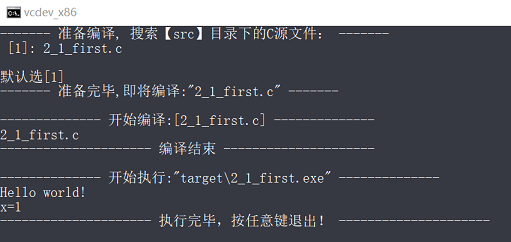

# 基本语法


##  一、初识C

### 1. C语言标准

1978年 K&R C 传统C

1989年 ANSI C ==> C89 

1990年 ISO C ==> C90 与C89相同

  C精神:

1. 信任程序员
2. 不要妨碍程序员做需要做的事
3. 保持语言精练简单
4. 只提供一种方法执行一项操作
5. 让程序运行更快，即使不能保证其可移植性

1994年 ANSI/ISO ==> C99

新目标：国际化、弥补缺陷和提高计算的实用性

2011年 ISO  ==> C11

2018年  ISO  ==> C17

主要学习 C89/90  用C99或C11介绍新特性


### 2.编译过程

**Linux**:

c语言编译过程：

1. 预处理(Preprocessing)
       展开头文件/宏替换/去掉注释/条件编译 (.i)

2. 编译(Compilation)
       检查语法，生成汇编代码 (.s)

3. 汇编(Assembly)
       汇编代码转换机器码    (.o)

4. 链接(Linking)
       链接到一起生成可执行程序    (.out .a .so)

**Windows**:

源代码(.c) --> 编译器  --> 目标代码(.obj) --> 连接器+库代码+启动代码 --> 可执行代码(.exe,.dll)

 

## 二、Hello World

### 1. 代码

[2_1_first.c](src/2_1_first.c) :

```c
#include <stdio.h> //引入文件头

int main(void) /* 函数头: 返回类型 函数名(参数[这里是void]) */
{
    printf("Hello world!\n"); //调用stdio标准库里的printf函数, \n是换行符

    int x; /* 定义一个名为x的变量 */
    x = 1; /* 为x赋一个值 */ 
    printf("x=%d\n",x); //再次调用stdio标准库里的printf函数，并传参数
    return 0; //返回一个数
}
```

### 2. 编译&运行

自己写了个脚本([compileAndRun.bat](compileAndRun.bat))来编译执行这个程序：



### 3.注意

1. 每次用到库函数，都会用#include指令包含ANSI/ISO标准指定的头文件
2. main函数必须加(void),返回值必须是int


## 三、数据类型

关键字：int、short、long、unsigned、char、float、double、_Bool、_Complex、_Imaginary
运算符：sizeof()
函数：scanf()


C语言数据类型关键字：

| K&R C    | C90    | C99               |
| -------- | ------ | ----------------- |
| int      | signed | _Bool(true/false) |
| long     | void   | _Complex(复数)    |
| unsigned |        | _Imaginary(虚数)  |
| char     |        |                   |
| float    |        |                   |
| double   |        |                   |

### 1. 整数

   > 1. 声明变量   int a,b,c;
   >
   > 2. 初始化变量  int i=1,j=2;
   >
   > 3. printf int占位符%d  
   >
   >    如：printf("%d",i) 
   >
   >    示例：[3_1_platinum.c](src/3_1_platinum.c)
   >
   > 4. 字面量：
   >
   >    十进制  7,    8,  9,   10,  15,  16
   >
   >    八进制  07,  10, 11, 12,  17, 20 
   >
   >    十六进制  0x7, 0X8 , 0x9, 0XA, 0XF, 0x10
   >
   >    printf 显示八进制占位符： %o ,带0前缀 %#o
   >
   >     printf 显示十六进制占位符： %x ,  %X,  带0x前缀 %#x,%#X
   >    
   >    示例：[3_2_int_Literal.c](src/3_2_int_Literal.c)

### 2. 整数其他形式

   > 附属关键字 short long unsigned
   >
   > short int 或 short
   >
   > long int 或 long
   >
   > long long int或long long 至少64bit
   >
   > unsigned int 或 unsigned 无符号整数(非负)
   >
   > unsigned short ,  unsigned long , unsigned long long
   >
   > 任何有符号类型前添加关键字signed可以强调有符号(有负数)， 如 signed int 等同于 int
   >
   > 
   >
   > c语言规定 
   >
   > short占用空间不能比int多 ，long占用空间不能比int少
   >
   > 现在个人计算机常见设置：long long - 64bit, long 32bit, short 16bit, int 16bit或32bit(依计算机自然字长而定)
   >
   > 
   >
   > long和long long字面常量
   >
   > 数字字面量后加L或l,
   >
   > 在支持long long类型的系统中，也可以使用ll或LL后缀表示long long类型，u或U后缀表示无符号，如5ull,5Ull,5llU,5LLu
   >
   > 
   >
   > printf中unsigned 用%u前缀，short用%h前缀，long用%l前缀，long long用%ll前缀
   >
   > 示例[3_3_more_int.c](src/3_3_more_int.c)
   >
   > 
   >
   > 整数运算溢出时，从整数类型能表示最小值开始计算
   >
   > 
   >
   > char类型-1字节
   >
   > 字符'j'  '\x6A' '\0152'
   >
   > printf 占位符%c
   >
   > 有些C编译器把char实现为有符号类型，这意味着char可表示的范围是-128～127。而有些C编译器把char实现为无符号类型
   >
   > C90: 
   >
   > unsigned char表示无符号字节字符
   >
   > signed char表示有符号字节字符
   >
   > 
   >
   > `_Bool`类型
   > C99标准添加了`_Bool`类型，用于表示布尔值，即逻辑值true和false。因为C语言用值1表示true，值0表示false，所以`_Bool`类型实际上也是一种整数类型。但原则上它仅占用1位存储空间，因为对0和1而言，1位的存储空间足够了
   >
   > 
   >
   > C99可移植类型
   >
   > ​	stdint.h和inttypes.h
   >
   > int8_t~int64_t， uint8_t ~ uint64_t
   >
   > int_least8_t uint_least8_t
   >
   > int_fast8_t uint_fast8_t
   >
   > 
   >
   > intmax_t uintmax_t
   >
   > 

### 3. 浮点型

   >float、double和long double
   >
   >浮点字面量：
   >
   >有符号的数字（包括小数点），后面紧跟e或E，最后是一个有符号数表示10的指数
   >
   >​	正号可以省略。可以没有小数点（如，2E5）或指数部分（如，19.28），但是不能同时省略两者。
   >
   >可以省略小数部分（如，3.E16）或整数部分（如，.45E-6），但是不能同时省略两者。
   >
   >
   >
   >C99 标准添加了一种新的浮点型常量格式——用十六进制表示浮点型常量，即在十六进制数前加上十六进制前缀（0x或0X），用p和P分别代替e和E，用2的幂代替10的幂（即，p计数法）。如下所示：
   >0xa.1fp10
   >
   >
   >
   >printf()函数使用％f转换说明打印十进制记数法的float和double类型浮点数，用％e打印指数记数法的浮点数。如果系统支持十六进制格式的浮点数，可用a和A分别代替e和E。打印long double类型要使用％Lf、％Le或％La转换说明
   >
   >
   >
   >IEEE浮点标准,在C11作为可选项
   >
   >

### 4. 复数

   > 一般而言，虚数类型都是可选项。C11标准把整个复数软件包都作为可选项
   >
   > 
   >
   > C语言有3种复数类型：`float_Complex`、`double_Complex`和`long double _Complex`。例如，`float _Complex`类型的变量应包含两个float类型的值，分别表示复数的实部和虚部。
   >
   > 
   >
   > 类似地，C语言的3种虚数类型是float _Imaginary、`double _Imaginary`和`long double _Imaginary`。
   >
   > 
   >
   > 如果包含complex.h头文件，便可用complex代替`_Complex`，用imaginary代替`_Imaginary`，还可以用I代替-1的平方根。

### 5. 其他类型

   > C语言还有一些从基本类型衍生的其他类型，包括数组、指针、结构和联合

### 6. 类型大小

   > sizeof是C语言的内置运算符，以字节为单位给出指定类型的大小
   >
   > 
   >
   > C99和C11提供％zd转换说明匹配sizeof的返回类型(size_t)
   >
   > 示例：[3_4_sizeof.c](src/3_4_sizeof.c)

### 7. 转义字符

   > 警报声（\a） 退格（\b）、水平制表符（\t）和回车（\t）
   >
   > 示例[3_5_escape.c](src/3_5_escape.c)


## 四、字符串

### 1.  介绍字符串

> 字符数组，末尾加'\0' (null 字符)
>
> 注意：只能输入ANSI字符，why?因为需要支持'\0'字符结尾
>
> 示例:[4_1_string_intro.c](src/4_1_string_intro.c)
>
> C99 和 C11 标准专门为 sizeof 运算符的返回类型添加了％zd 转换说明
>
> scanf安全性不够，C4996提示用scanf_s


### 2. 预处理器 

   > #define NAME value
   >
   > 常量限定符 const(定义只读变量)
   >
   > limits.sh和float.h数据范围常量
   >
   > CHAR_MIN SHRT_MIN INT_MIN UINT_MIN ULONG_MIN FLT_MIN DBL_MIN
   >
   > CHAR_MAX SHRT_MAX INT_MAX UINT_MAX ULONG_MAX FLT_MAX DBL_MAX


### 3. printf & scanf

> 1. printf-转换说明符(conversion specification)
>
> 浮点数  -- 16进制和p计数法：%a、%A     10进制:%f   e计数法：%e,%E  自动匹配%g %G
> 单字符  --  %c
> 字符串  --  %s
> 有符号10进制整数  --   %d、%i
> 无符号10进制整数  --   %u
> 无符号8进制整数  --   %o
> 无符号16进制整数  --   %X、%x
> 指针  -- %p
>
> 2. printf-转换修饰符
>
>    
>
> 3. scanf
>
>    scanf()函数允许把普通字符放在格式字符串中
>
>    如：`scanf("％d,％d", &n, &m);` 必须输入逗号"," 但可以跳过空格
>
>    scanf()函数返回成功读取的项数。
>    没有读到或没有正确正确读取时scanf()返回0。
>    当scanf()检测到“文件结尾”时，会返回EOF
>
>    scanf("％c",num)会读取每个字符，包括空格
>
> 4. 如果你不想预先指定字段宽度，希望通过程序来指定，那么可以用`*`修饰符代替字段宽度。
>
>    但还是要用一个参数告诉函数，字段宽度应该是多少。
>
>    如`printf("The number is: ％*d.\n", width, number);`
>
>    scanf()中`*`的用法与此不同。把*放在％和转换字符之间时，会使得scanf()跳过相应的输出项


## 五、运算符

### 1.循环

> while (*condition*) { }
>
> 示例 [5_1_shoe_size.c](src/5_1_shoe_size.c)

### 2.运算符operator

> 赋值运算=
>
> 术语：数据对象、左值、右值和运算符
>
> 用于储存值的数据存储区域统称为**数据对象（data object）**
>
> **左值（lvalue）**是 C 语言的术语，用于标识特定数据对象的名称或表达式。因此，对象指的是实际的数据存储，而左值是用于标识或定位存储位置的标签。
>
> ​	可修改的左值（modifiable lvalue），用于标识可修改的对象。
>
> ​    所以，赋值运算符的左侧应该是可修改的左值。当前标准建议，使用术语对象定位值（object locator value）更好
>
> 可以多重赋值：a=b=c=1;（赋值表达式 返回的结果就是被赋的值)
>
> 
>
> 算术运算符：加+、减-、乘*、除/
>
> 运算符优先级 ：
>
> 1. 小括号()最优先 ，从左往右结合
>
> 2. 正+负-号 （一元运算）
>
> 3. 乘除
>
> 4. 加+减-
>
> 5. 赋值=
>
> sizeof运算符 返回size_t类型
> 求模运算符 %
> 递增运算++
> 递减运算--
>
> 
>

### 3.表达式+语句

> 术语：
>
> **表达式（expression）**由运算符和运算对象组成
>
> 每个表达式都有一个值
>
> **语句（statement）**
>
> 语句（statement）是C程序的基本构建块。一条语句相当于一条完整的计算机指令。在C中，大部分语句都以分号结尾
>
> 例：赋值表达式语句的结构是，一个变量名，后面是一个赋值运算符，再跟着一个表达式，最后以分号结尾
>
> while语句是一种迭代语句，有时也被称为结构化语句，因为它的结构比简单的赋值表达式语句复杂
>
> 
>
> **副作用（side effect）**是对数据对象或文件的修改
>
> 完整表达式（full expression），就是指这个表达式不是另一个更大表达式的子表达式
>
> **序列点（sequence point）**是程序执行的点，在该点上，所有的副作用都在进入下一步之前发生。在 C语言中，语句中的分号标记了一个序列点。意思是，在一个语句中，赋值运算符、递增运算符和递减运算符对运算对象做的改变必须在程序执行下一条语句之前完成。
>
> **复合语句（compound statement）**是用花括号括起来的一条或多条语句，复合语句也称为块（block）。
>
> 

### 4.类型转换

> 基本的类型转换规则:
>
> 1. 当类型转换出现在表达式时，从较小类型转换为较大类型，所以这些转换被称为升级（promotion）
> 2. 涉及两种类型的运算，两个值会被分别转换成两种类型的更高级别
> 3. 类型的级别从高至低依次是long double、double、float、unsigned long long、long long、unsigned long、long、unsigned int、int
> 4. 在赋值表达式语句中，计算的最终结果会被转换成被赋值变量的类型。这个过程可能导致类型升级或降级（demotion）。所谓降级，是指把一种类型转换成更低级别的类型。
> 5. 当作为函数参数传递时，char和short被转换成int，float被转换成double。
>
> 降级处理：
>
> 1. 目标类型是无符号整型，且待赋的值是整数时，额外的位将被忽略
>
> 2. 如果目标类型是一个有符号整型，且待赋的值是整数，结果因实现而异。
> 3.  如果目标类型是一个整型，且待赋的值是浮点数，该行为是未定义的。
>
> 
>
>  强制类型转换运算符:
>
> 圆括号和它括起来的类型名构成了强制类型转换运算符（cast operator）
>
> 如：int a=(int)1.5;

### 5.待参数的函数

> 声明参数就创建了被称为形式参数（简称形参）的变量
>
> 函数调用传递的值为实际参数，简称实参
>
> 是C99标准规定 :实参术语actual  argument;  形参术语formal parameter
>
>  示例[5_2_func_param.c](src/5_2_func_param.c)
>
> **函数声明**只指明了函数名和返回类型，没有指明参数类型
>
> **函数原型**在函数声明的基础上包含形参。

## 六、循环语句

### 1. while循环

> while( expression) 
>
> { statement }
>
> 入口条件循环entry condition

### 2. 条件运算符

   > < > == != >= <=
   >
   > 
   >
   > 一般而言，所有的非零值都视为真，只有0被视为假
   >
   > 
   >
   > C一直用int类型的变量表示真/假值。C99专门针对这种类型的变量新增了_Bool类型
   >
   > C99提供了stdbool.h头文件，该头文件让bool成为_Bool的别名，而且还把true和false分别定义为1和0的符号常量
   >

### 3. for循环

> while循环是不确定循环（indefinite loop）。所谓不确定循环，指在测试表达式为假之前，预先不知道要执行多少次循环。
>
> 还有一类是计数循环（counting loop）。这类循环在执行循环之前就知道要重复执行多少次。
>
> for循环语法：
>
> for　(　initialize;　test;　update　)
> 　　statement

### 4. 其他运算符

> 其他赋值运算符：+=、-=、*=、/=、％=
>
> **逗号运算符**扩展了for循环的灵活性，以便在循环头中包含更多的表达式

### 5. do while循环

> while循环和for循环都是入口条件循环，即在循环的每次迭代之前检查测试条件，所以有可能根本不执行循环体中的内容。
>
> C语言还有出口条件循环（exit-condition loop），即在循环的每次迭代之后检查测试条件，这保证了至少执行循环体中的内容一次。
>
> 如 do while循环，语法：
>
> do{
> 　　statement;
> }while　(　expression　);

### 6.循环与数组

> 数组（array）是按顺序储存的一系列类型相同的值,。整个数组有一个数组名，通过整数下标访问数组中单独的项或元素（element）
>
> char类型的数组末尾包含一个表示字符串末尾的空字符\0，则该数组中的内容就构成了一个字符串
>
> ~~~c
> int nums[22]; // 可储存10个int类型的数组
> char str[]={'h','e','l','l','o','\0'}; //char数组，因为末尾有0,所以也是一个字符串
> ~~~
>
> 循环遍历数组：[6_1_for_loop_array.c](src/6_1_for_loop_array.c)


## 七、分支&跳转

### 1.判断if else

> if语句被称为分支语句（branching statement）或选择语句（selection statement），因为它相当于一个交叉点，程序要在两条分支中选择一条执行。if语句的通用形式如下：
> `if ( expression ) { statement }`
>
> 
>
> if else语句的通用形式是：
>
> ```c
> if ( expression ) { statement }
> else { statement3} 
> ```
>
> 
>
> 
>
> 多重if else 
>
> ```c
> if ( expression1 ) { statement1} 
> else if ( expression2 ) { statement2} 
> else if ( expression3 ) { statement3} 
> else if ( expression4 ) { statement4} 
> ...
> else { statementN} 
> ```
>
> 
>
> 
>
> <stdio.h>中：
>
> getchar() 从输入队列中返回下一个字符
>
> putchar(char) 输出一个字符到显示器
>
> < ctype.h>中有字符判断函数:如isalpha(char), isblank(char), isdigit(char) isspace(char)  islower(char) issupper(char)等等
>
> 示例:[7_1_change_input.c](src/7_1_change_input.c)

### 2. 逻辑运算符

> 与&&  或|| 非 !
>
> 引入<iso646.h>(C95)可以用备选拼写
>
> && 对应 and ， || 对应 or  ， ! 对应 not

### 3. 条件运算符

> 又称三元运算符或三目运算符
>
> `expression1 ? expression2：expression3`
>
> 如果 expression1 为真（非 0），那么整个条件表达式的值与 expression2 的值相同；如果expression1为假（0），那么整个条件表达式的值与expression3的值相同
>
> 如求最大值：
>
> `max = (a > b) ? a：b;`

### 4. continue & break

> 3种循环都可以使用continue语句。执行到该语句时，会跳过本次迭代的剩余部分，并开始下一轮迭代。如果continue语句在嵌套循环内，则只会影响包含该语句的内层循环
>
> 程序执行到循环中的break语句时，会终止包含它的循环，并继续执行下一阶段。如果break语句位于嵌套循环内，它只会影响包含它的当前循环。
>
> 

### 5. switch+break

> 
> 语法:
> ```c
> switch ( 整型表达式)
> {
> 　　case 常量1：
> 　　　　语句　　　//可选
> 　　　　break;  //可选
> 　　case 常量2：
> 　　　　语句　　　//可选
> 　　　　break;  //可选
> 　　default：　　 //可选
> 　　　　语句　　　//可选
> 　　　　break;  //可选
> }
> ```
>

### 6. goto语句
> goto语句有两部分：goto和标签名。标签的命名遵循变量命名规则，如下所示：
> `goto part2;`
> 要让这条语句正常工作，函数还必须包含另一条标为part2的语句，该语句以标签名后紧跟一个冒号开始：
> `part2：printf("xxx");`
>
> **避免使用goto**

### 7. 字符操作、io流

> 缓冲区
>
> 大部分系统在用户按下Enter键之前不会重复打印刚输入的字符，这种输入形式属于缓冲输入。用户输入的字符被收集并储存在一个被称为缓冲区（buffer）的临时存储区，按下Enter键后，程序才可使用用户输入的字符
>
>  某些交互式程序也需要无缓冲输入。例如，在游戏中，你希望按下一个键就执行相应的指令
>
> 
>
> 可以用处理文件的方式来处理键盘输入。例如，程序读文件时要能检测文件的末尾才知道应在何处停止。因此，C 的输入函数内置了文件结尾检测器。既然可以把键盘输入视为文件，那么也应该能使用文件结尾检测器结束键盘输入
>
> 检测文件结尾的一种方法是，在文件末尾放一个特殊的字符标记文件结尾。CP/M、IBM-DOS和MS-DOS的文本文件曾经用过这种方法。
>
> 在C语言中，用getchar()读取文件检测到文件结尾时将返回一个特殊的值，即EOF（end of file的缩写，定义在stdio.h文件）。scanf()函数检测到文件结尾时也返回EOF
>
> 
>
> 字符操作：[7_1_char_get_put.c](src/7_1_char_get_put.c)
>
> 编译产生可执行文件：7_1_char_get_put.exe
>
> 1. 重定向输入，将my.txt文件的内容输出屏幕上:
>
>    `7_1_char_get_put.exe<my.txt`
>
> 2. 重定向输出，接收键盘输入，输出到my.txt文件
>
>    `7_1_char_get_put.exe>my.txt`
>
> 3. 组合重定向，复制my.txt到target.txt
>
>    `7_1_char_get_put.exe<my.txt>target.txt`
>
> 


## 八、函数

//todo
